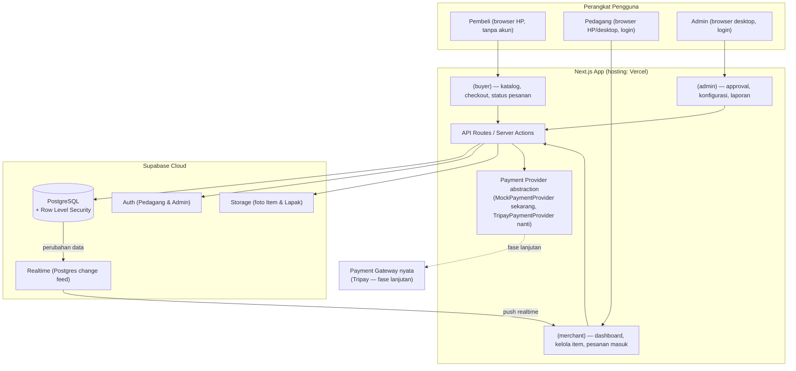

# Arsitektur Sistem

## Gambaran Umum

MyGerai dibangun sebagai **satu aplikasi monolith Next.js** (bukan microservices) — sesuai [RULES.md](RULES.md#4-prioritas-desain) untuk menghindari over-engineering di skala kecil. Tiga "muka" (Pembeli, Pedagang, Admin) adalah route group berbeda dalam aplikasi yang sama, berbagi satu database Supabase.

## Alur Data: Checkout → Pembayaran → Notifikasi Pedagang

Lihat sequence diagram lengkap di [PRD.md §6.1](PRD.md#61-alur-pembeli). Poin arsitektural penting:

1. **Pembuatan Pesanan** terjadi lewat Server Action (bukan API route publik biasa) supaya validasi (harga, ketersediaan Item, isi Nama) terjadi di server, bukan dipercaya dari input klien.
2. **Total harga dihitung ulang di server** dari `products.price` saat itu (jangan percaya total yang dikirim dari browser) — mencegah manipulasi harga oleh Pembeli.
3. **`platform_fee_snapshot`** diambil dari `platform_config` aktif saat itu juga (lihat [DATA-MODEL.md](DATA-MODEL.md)).
4. Setelah Pesanan tercipta (`menunggu_pembayaran`), `PaymentProvider.createPayment()` dipanggil:
   - Tahap sekarang → `MockPaymentProvider`: langsung siapkan tombol simulasi, tidak ada pemanggilan API eksternal.
   - Fase lanjutan → `TripayPaymentProvider`: memanggil API Tripay untuk membuat QRIS dinamis sungguhan.
5. Konfirmasi pembayaran masuk lewat `PaymentProvider.handleCallback()`:
   - Mock: dipanggil langsung dari tombol UI Pembeli (aman karena bukan uang sungguhan).
   - Tripay (nanti): dipanggil dari **endpoint webhook** yang **wajib** verifikasi signature sebelum memproses apa pun (lihat [RULES.md §7](RULES.md#7-keamanan)) — jangan pernah percaya payload webhook tanpa verifikasi.
6. Perubahan status Pesanan di database otomatis terdorong ke dashboard Pedagang lewat **Supabase Realtime** — Pedagang tidak perlu refresh manual.
7. Pembeli memantau status Pesanannya lewat halaman yang sama-sama subscribe Realtime ke baris Pesanan miliknya (dibatasi lewat RLS, lihat [DATA-MODEL.md §Keamanan Multi-tenant](DATA-MODEL.md#keamanan-multi-tenant-row-level-security)).

## Keamanan Multi-tenant

Lihat detail policy di [DATA-MODEL.md](DATA-MODEL.md#keamanan-multi-tenant-row-level-security). Prinsip: **isolasi lewat RLS di level database**, bukan hanya lewat logika aplikasi — supaya bug di satu halaman tidak bisa membocorkan data Pedagang lain.

## Kedaluwarsa Pesanan

Karena tidak ada background worker terpisah di tahap MVP (menghindari infrastruktur tambahan), status `kedaluwarsa` dicek secara **lazy**: setiap kali sebuah Pesanan `menunggu_pembayaran` dibaca (oleh Pembeli atau Pedagang) dan `now() > expires_at`, sistem langsung meng-update statusnya saat itu juga. Jika nanti volume besar & butuh kepastian (mis. Pesanan yang tidak pernah dibuka lagi oleh siapa pun), baru pertimbangkan cron job (lihat [BACKLOG.md](BACKLOG.md)).

## Keputusan Arsitektur Penting (ADR Ringkas)

| Tanggal | Keputusan | Alasan |
|---|---|---|
| 2026-09-05 | Model settlement **Agregator**, bukan Sub-merchant | Target pasar (pedagang kaki lima) kemungkinan besar tidak punya rekening bisnis/legalitas untuk daftar payment gateway sendiri. Agregator meniadakan friksi ini. Konsekuensi: Aplikator menampung dana sementara → butuh Pencairan manual (MVP) lalu otomatis (nanti). |
| 2026-09-05 | Payment gateway pilihan: **Tripay** (untuk fase lanjutan, belum dipakai sekarang) | Status badan usaha Aplikator: perorangan → Tripay salah satu yang bisa didaftar cukup dengan KTP. |
| 2026-09-05 | Pembayaran MVP **disimulasikan** (`MockPaymentProvider`) | Keputusan eksplisit User: fokus dulu ke alur inti pesanan sebelum urus approval merchant gateway sungguhan. |
| 2026-09-05 | Satu aplikasi monolith Next.js, bukan microservices | Skala kecil, tim kecil (User + Claude) — microservices akan menambah overhead ops tanpa manfaat di tahap ini. |
| 2026-09-05 | Autentikasi Pedagang/Admin tanpa OTP (nomor HP + password) | Hindari biaya SMS/WA OTP di awal; verifikasi identitas cukup lewat approval manual Admin. |

> Tambahkan baris baru di sini setiap kali ada keputusan arsitektur baru/berubah — jangan menghapus baris lama (biarkan jadi histori), cukup tandai kalau sudah tidak berlaku dan rujuk baris penggantinya. Sinkronkan juga dengan [CHANGELOG.md](../CHANGELOG.md).
