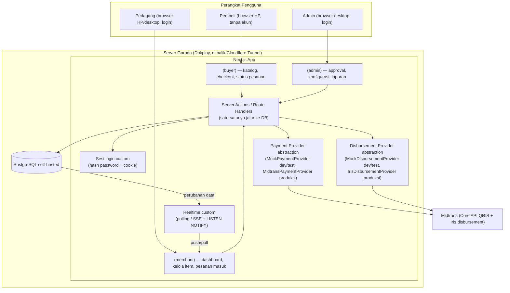

# Arsitektur Sistem

## Gambaran Umum

MyGerai dibangun sebagai **satu aplikasi monolith Next.js** (bukan microservices) — sesuai [RULES.md](RULES.md#4-prioritas-desain) untuk menghindari over-engineering di skala kecil. Tiga "muka" (Pembeli, Pedagang, Admin) adalah route group berbeda dalam aplikasi yang sama, berbagi satu database PostgreSQL. Aplikasi & database sama-sama **self-hosted** di server milik User (Garuda), lihat ADR di bawah.

## Alur Data: Checkout → Pembayaran → Notifikasi Pedagang

Lihat sequence diagram lengkap di [PRD.md §6.1](PRD.md#61-alur-pembeli). Poin arsitektural penting:

1. **Pembuatan Pesanan** terjadi lewat Server Action (bukan API route publik biasa) supaya validasi (harga, ketersediaan Item, isi Nama) terjadi di server, bukan dipercaya dari input klien.
2. **Total harga dihitung ulang di server** dari `products.price` saat itu (jangan percaya total yang dikirim dari browser) — mencegah manipulasi harga oleh Pembeli.
3. **`platform_fee_snapshot`** diambil dari `platform_config` aktif saat itu juga (lihat [DATA-MODEL.md](DATA-MODEL.md)).
4. Setelah Pesanan tercipta (`menunggu_pembayaran`), `PaymentProvider.createPayment()` dipanggil. Provider dipilih lewat env `PAYMENT_PROVIDER`:
   - `mock` (dev/unit/E2E test) → `MockPaymentProvider`: siapkan QR dummy + tombol "Simulasikan Pembayaran Berhasil", tidak ada pemanggilan API eksternal.
   - `midtrans` (staging/produksi) → `MidtransPaymentProvider`: memanggil **Midtrans Core API** (`/v2/charge`, `payment_type: "qris"`) untuk membuat QRIS dinamis sungguhan; `qr_string` yang dikembalikan dirender jadi gambar QR **secara lokal** pakai lib `qrcode` (tidak menarik gambar dari host Midtrans).
5. Konfirmasi pembayaran masuk lewat `PaymentProvider.handleCallback()`:
   - Mock: dipanggil langsung dari tombol UI Pembeli (aman karena bukan uang sungguhan).
   - Midtrans: dipanggil dari **endpoint webhook `POST /api/webhooks/payment`** (Notification URL Midtrans) yang **wajib** verifikasi `signature_key` = `SHA512(order_id + status_code + gross_amount + ServerKey)` **sebelum** memproses apa pun (lihat [RULES.md §7](RULES.md#7-keamanan)) — jangan pernah percaya payload webhook tanpa verifikasi. Hanya notifikasi `settlement`/`capture` yang terverifikasi memicu transisi `menunggu_pembayaran → dibayar`.
6. Perubahan status Pesanan di database sampai ke dashboard Pedagang lewat **polling berkala** dari Server Action (bukan Supabase Realtime — lihat ADR di bawah) — Pedagang tidak perlu refresh manual, tapi update-nya berjarak beberapa detik (bukan push instan), cukup untuk skala pedagang kaki lima.
7. Pembeli memantau status Pesanannya lewat halaman yang membaca `orders` by primary key (`orderId` di URL, UUID praktis tak tertebak) lewat Server Component/Route Handler — bukan subscribe langsung ke database (lihat [DATA-MODEL.md §Keamanan Multi-tenant](DATA-MODEL.md#keamanan-multi-tenant-isolasi-level-aplikasi)).

## Alur Data: Pencairan Otomatis ke Pedagang (Model B — Fase 6)

1. **Dana Pembeli** dari semua Lapak masuk ke **satu akun Midtrans milik Aplikator** (model Agregator). Aplikator menarik saldo Midtrans-nya ke rekening bank Aplikator (H+1, di luar sistem MyGerai).
2. **Saldo Pedagang** adalah nilai turunan: `SUM(orders.total_for_merchant WHERE status ∈ {dibayar, diproses, siap_diambil, selesai} AND payout_id IS NULL)` per Lapak — bagian yang **belum** masuk Pencairan mana pun.
3. **Scheduled Job** memanggil `POST /api/cron/disburse` (header `Authorization: Bearer $CRON_SECRET`) sekali sehari. Untuk tiap Lapak yang punya Saldo > 0 **dan** info rekening tervalidasi:
   - Dalam satu transaksi DB: kunci baris Pesanan Lapak tsb yang `payout_id IS NULL`, buat baris `payouts` (status `pending`, `period_date = hari ini`, `amount = SUM(total_for_merchant)`), set `payout_id` pada Pesanan tsb. `UNIQUE(merchant_id, period_date)` mencegah dobel batch hari yang sama.
   - Di luar transaksi: `DisbursementProvider.createPayout()` → Midtrans **Iris** `/api/v1/payouts`. Status jadi `processing`. `transfer_fee` dari respons Iris; `net_amount = amount − transfer_fee` (biaya transfer ditanggung Pedagang).
4. **Status akhir Pencairan** masuk lewat webhook `POST /api/webhooks/payout` (callback Iris, diverifikasi) → `completed` (isi `settled_at`) atau `failed` (isi `failure_reason`; Pesanan di-*unlink* `payout_id = NULL` supaya ikut batch berikutnya).
5. Pencairan **manual dihapus**. `/admin/payouts` hanya menampilkan Saldo tiap Lapak + riwayat Pencairan (read-only).

## Keamanan Multi-tenant

Lihat detail aturan di [DATA-MODEL.md](DATA-MODEL.md#keamanan-multi-tenant-isolasi-level-aplikasi). Prinsip: database **hanya** diakses lewat kode server tepercaya (Server Action/Route Handler) — browser tidak pernah konek langsung ke Postgres. Karena itu isolasi antar Lapak ditegakkan **di level aplikasi** (setiap fungsi yang menyentuh data Pedagang wajib memfilter berdasar identitas sesi login), bukan Row Level Security database — supaya bug di satu halaman tidak bisa membocorkan data Pedagang lain, disiplin ini harus konsisten dijaga di setiap Server Action baru.

## Kedaluwarsa Pesanan

Karena tidak ada background worker terpisah di tahap MVP (menghindari infrastruktur tambahan), status `kedaluwarsa` dicek secara **lazy**: setiap kali sebuah Pesanan `menunggu_pembayaran` dibaca (oleh Pembeli atau Pedagang) dan `now() > expires_at`, sistem langsung meng-update statusnya saat itu juga. Jika nanti volume besar & butuh kepastian (mis. Pesanan yang tidak pernah dibuka lagi oleh siapa pun), Scheduled Job `/api/cron/*` yang dipakai Pencairan otomatis (Fase 6, lihat di atas) bisa sekalian menyapu Pesanan kedaluwarsa — mekanismenya sudah ada, tinggal ditambah endpoint.

## Keputusan Arsitektur Penting (ADR Ringkas)

| Tanggal | Keputusan | Alasan |
|---|---|---|
| 2026-09-05 | Model settlement **Agregator**, bukan Sub-merchant | Target pasar (pedagang kaki lima) kemungkinan besar tidak punya rekening bisnis/legalitas untuk daftar payment gateway sendiri. Agregator meniadakan friksi ini. Konsekuensi: Aplikator menampung dana sementara → butuh Pencairan manual (MVP) lalu otomatis (nanti). _(Model Agregator **tetap berlaku**; "Pencairan manual" bagian dari baris ini digantikan oleh baris 2026-09-08 "Pencairan otomatis".)_ |
| 2026-09-05 | ~~Payment gateway pilihan: **Tripay**~~ — **DIGANTIKAN** baris 2026-09-08 (Midtrans). | Status badan usaha Aplikator: perorangan → Tripay salah satu yang bisa didaftar cukup dengan KTP. Alasan pengganti: butuh disbursement (Iris) satu ekosistem untuk Pencairan otomatis — lihat baris 2026-09-08. |
| 2026-09-05 | Pembayaran MVP **disimulasikan** (`MockPaymentProvider`) | Keputusan eksplisit User: fokus dulu ke alur inti pesanan sebelum urus approval merchant gateway sungguhan. |
| 2026-09-05 | Satu aplikasi monolith Next.js, bukan microservices | Skala kecil, tim kecil (User + Claude) — microservices akan menambah overhead ops tanpa manfaat di tahap ini. |
| 2026-09-05 | Autentikasi Pedagang/Admin tanpa OTP (nomor HP + password) | Hindari biaya SMS/WA OTP di awal; verifikasi identitas cukup lewat approval manual Admin. |
| 2026-09-05 | **Digantikan** oleh baris di bawah: rencana awal DB/Auth/Realtime/Storage/hosting via Supabase Cloud + Vercel | (baris ini tidak pernah dieksekusi — diganti sebelum ada project Supabase dibuat) |
| 2026-09-05 | Database, Auth, Realtime, Storage, dan hosting aplikasi **self-hosted** di server Garuda (milik User) via **Dokploy** + **Cloudflare Tunnel**, menggantikan rencana Supabase Cloud + Vercel | User sudah punya server & pola ops ini yang terbukti jalan untuk proyek lain (MyPlaza, Postgres+Dokploy+Cloudflare Tunnel) — reuse infrastruktur & pengalaman yang sudah ada, tanpa akun cloud baru/biaya tambahan. Konsekuensi: Auth, Realtime, Storage yang tadinya bawaan Supabase kini dibangun custom (lihat [TEKNOLOGI.md](TEKNOLOGI.md)); isolasi multi-tenant pindah dari RLS database ke level aplikasi (lihat [DATA-MODEL.md](DATA-MODEL.md#keamanan-multi-tenant-isolasi-level-aplikasi)) karena browser tidak lagi konek langsung ke DB seperti model Supabase `anon`/`authenticated`. |
| 2026-09-07 | Migrasi database dijalankan **otomatis saat container start** lewat `docker-entrypoint.sh` (skrip `src/lib/db/migrate.ts` pakai migrator `drizzle-orm`, di-*bundle* esbuild jadi file mandiri di image) — bukan langkah manual terpisah | User minta deploy tanpa langkah manual. Aman karena deployment **single-instance** (Dokploy, satu container) — tidak ada race migrasi antar-instance; asumsi yang sama sudah dipakai rate-limiter in-memory (lihat [TEKNOLOGI.md §Autentikasi](TEKNOLOGI.md#autentikasi)). Kalau nanti pindah multi-instance, migrasi harus dipisah jadi job/release-phase tersendiri. Seed data demo ikut jalan di entrypoint **hanya bila `SEED_DEMO=true`** (idempoten, tanpa TRUNCATE); akun Admin tetap dibuat manual (`pnpm admin:create`). |
| 2026-09-08 | **Stok Item** (`products.stock`, opsional): berkurang **saat Pesanan `dibayar`** (bukan saat dibuat), `GREATEST(stock-qty,0)` dalam transaksi yang sama dengan transisi status. Pengecekan `qty ≤ stock` juga dilakukan saat `createOrder` (best-effort). | Keputusan User (AskUserQuestion 2026-09-08): sederhana — tak perlu mengembalikan stok saat Pesanan kedaluwarsa. Trade-off diterima: 2 Pembeli bisa sama-sama bayar untuk stok terakhir (oversell tipis) di skala kaki lima. Kalau nanti perlu ketat: pindah ke lock/reservasi saat checkout. |
| 2026-09-08 | Foto Item yang diunggah Pedagang disimpan di **volume Docker persisten** di server Garuda (bukan Cloudflare R2), di `UPLOADS_DIR` (`/app/uploads` di produksi). Disajikan lewat Route Handler `src/app/uploads/[...path]/route.ts`. | Keputusan User (AskUserQuestion 2026-09-07): pola paling sederhana, tanpa akun/API/service baru. **Konsekuensi**: container aplikasi **tidak lagi 100% stateless** — perlu named volume dimount di Dokploy (`/app/uploads`), dan backup foto = backup volume (manual). Kalau nanti pindah multi-instance atau butuh CDN, migrasi ke object storage (R2). Upload: hanya Pedagang login, validasi magic-bytes (JPG/PNG/WebP, tolak SVG), nama file `randomUUID`, di-resize di klien dulu. |
| 2026-09-08 | **Integrasi pembayaran nyata pakai Midtrans** (Core API untuk QRIS dinamis), **menggantikan rencana Tripay**. Model settlement **tetap Agregator**, tapi **Pencairan otomatis ("Model B")** menggantikan Pencairan manual Admin: dana Pembeli masuk **1 akun Midtrans milik Aplikator** → job harian memanggil **Midtrans Iris** (produk disbursement) untuk transfer **Saldo Pedagang** tiap Lapak otomatis ke rekening/e-wallet mereka. | Keputusan User setelah membandingkan 3 model (Agregator+manual / Agregator+auto-disburse / Split-Marketplace). **Split murni ditunda**: fitur marketplace/split Midtrans kemungkinan menuntut badan usaha (status Aplikator = **perorangan**) — perlu diverifikasi User. **Model B** dipilih: cukup akun Midtrans standar, menghapus kerja manual Admin, Biaya Layanan tetap terpungut otomatis (Aplikator memegang dana dulu). **Tripay diganti** karena Midtrans punya Iris (disbursement) satu ekosistem, sandbox lengkap, dokumentasi lebih baik. Baris ini **merevisi sebagian** ADR 2026-09-05 (Tripay & "Pencairan manual") — model Agregator tetap, mekanisme pencairan berubah. Payment tetap lewat abstraksi `PaymentProvider`; disbursement lewat abstraksi `DisbursementProvider` baru. |
| 2026-09-08 | **MDR QRIS ditanggung Aplikator**, **tidak pernah dibebankan ke Pembeli** (dilarang **PBI No. 23/6/PBI/2021 Pasal 52 ayat (1)**, diperkuat PBI 10/2025 + PADG 32/2025 efektif 31 Maret 2026 — sanksi s/d pencabutan izin QRIS). Pembeli bayar **persis `subtotal`** (harga Item, tanpa tambahan). MDR mengurangi margin bersih Aplikator (`Biaya Layanan − MDR`), bisa **negatif tipis** di transaksi sangat kecil — **diterima** sebagai trade-off skala kaki lima. | Regulasi BI. Alternatif "Pedagang tanggung MDR" sah tapi User memilih kesederhanaan: **nol perubahan** pada kalkulasi Pesanan (`src/lib/utils/order-calc.ts`) & UI checkout. `platform_config.qris_mdr_bps` (default `70` = 0,70%) disediakan **hanya untuk estimasi margin** di laporan Admin — tarif nyata (bisa 0% untuk transaksi kecil skema "QRIS bebas biaya" UMI, atau ~0,7%) mengikuti klasifikasi akun Midtrans, dikonfirmasi User. |
| 2026-09-08 | **Pencairan otomatis = batch harian, tanpa ambang minimum.** Biaya transfer Iris (~Rp2.500–5.000/transfer bank; lebih murah/gratis untuk e-wallet) **dipotong dari tiap Pencairan** (ditanggung Pedagang): `payout.net_amount = payout.amount − payout.transfer_fee`. **Pencairan manual dihapus** — `/admin/payouts` jadi halaman laporan/riwayat saja. Job dipicu lewat **Route Handler `POST /api/cron/disburse`** (dilindungi header rahasia `CRON_SECRET`), dipanggil Scheduled Job Dokploy / cron eksternal — **bukan worker/proses terpisah**. | Keputusan User (AskUserQuestion 2026-09-08). "Tanpa ambang" aman karena bukan Aplikator yang menanggung biaya transfer. Idempotensi batch: `UNIQUE(payouts.merchant_id, payouts.period_date)` + `orders.payout_id` (order yang sudah masuk satu Pencairan tidak ikut lagi). Endpoint di Route Handler konsisten dengan asumsi single-instance (sama seperti migrasi otomatis di entrypoint & rate-limiter in-memory) — tanpa infrastruktur tambahan; tetap aman kalau nanti multi-instance (lock DB per-Lapak + idempotensi tanggal). |
| 2026-09-08 | **Webhook Midtrans (`POST /api/webhooks/payment`) WAJIB verifikasi `signature_key`** = `SHA512(order_id + status_code + gross_amount + ServerKey)` sebelum memproses apa pun ([RULES §7.2](RULES.md#7-keamanan)). Transisi `menunggu_pembayaran → dibayar` hanya dari notifikasi `settlement`/`capture` yang terverifikasi (bukan dari input klien). Status callback Iris masuk lewat `POST /api/webhooks/payout` (juga diverifikasi). `MockPaymentProvider` + tombol "Simulasikan Pembayaran Berhasil" **tetap ada** untuk dev/unit/E2E test — provider dipilih lewat env `PAYMENT_PROVIDER` (`mock` default \| `midtrans`). QR dirender **lokal** dari `qr_string` Midtrans pakai lib `qrcode` yang sudah ada (tak perlu `next.config` `remotePatterns`). | **Refund/pembatalan Pesanan setelah `dibayar` DITUNDA** (di luar scope Fase 6 ini) — dicatat sebagai keterbatasan diketahui. Accelerated/instant settlement Midtrans **tidak dipakai** (biaya ekstra) — terima H+1 apa adanya. |

| 2026-09-09 | **Biaya Layanan platform dibebankan ke PEMBELI** (bukan lagi dipotong dari bagian Pedagang). Pembeli membayar `grand_total = subtotal + platform_fee_snapshot` (Item Rp10.000 → bayar Rp11.000); Pedagang menerima `subtotal` **penuh** (`total_for_merchant = subtotal`). Nilai yang dikirim ke gateway & disimpan `payments.gross_amount` = `grand_total`. **Tidak ada kolom/migrasi baru** — `grand_total` = turunan dua kolom snapshot yang sudah ada. | Keputusan User (AskUserQuestion 2026-09-09) — hard switch, bukan toggle. **Merevisi sebagian** ADR 2026-09-08: bagian "Pembeli bayar persis `subtotal`" tidak lagi berlaku. **Bagian MDR TIDAK berubah**: MDR QRIS tetap ditanggung Aplikator, tidak pernah di-surcharge ke Pembeli (PBI 23/6/PBI/2021 Ps. 52). Yang di-on-top ke Pembeli adalah **Biaya Layanan platform** MyGerai (analog "Biaya Layanan" GoFood/GrabFood), diposisikan & dilabeli konsisten sebagai biaya **layanan pemesanan** (bukan "biaya QRIS"). **PR User sebelum go-live produksi:** konfirmasi ke konsultan/Midtrans bahwa framing ini aman (dicatat di [BACKLOG.md](BACKLOG.md)). Ekonomi: Pedagang lebih untung (harga penuh), Aplikator margin ≈ `Biaya Layanan − MDR(grand_total)`, Pembeli menanggung Rp1.000. |
| 2026-09-09 | **Asisten rekomendasi di Laporan Penjualan = mesin aturan deterministik, BUKAN LLM.** Fungsi pure di `src/lib/report/insights.ts` membaca agregat penjualan 30 hari (dari `src/server/reports.ts`) dan memancarkan `Insight[]` lewat 7 rule ber-ambang (restock, Item mati, jam ramai, hari sepi, Pareto menu, sering dibeli bareng, harga). Gerbang data global: diam total kalau < 20 Pesanan dibayar / riwayat < 7 hari. | Keputusan User (AskUserQuestion 2026-09-09). LLM akan melanggar prinsip "self-hosted tanpa layanan eksternal" (butuh API key + biaya per panggilan + koneksi keluar) untuk manfaat yang belum jelas di skala kaki lima. Mesin aturan: gratis, instan, jalan offline, hasilnya bisa diuji unit (`tests/unit/report-insights.test.ts`). Laporan **tidak** menambah kolom/tabel — hanya query agregat read-only atas `orders`/`order_items` yang sudah ada, difilter `merchant_id` dari sesi (isolasi multi-tenant). Semua bucket waktu (harian/jam/hari-dalam-minggu) dipatok `Asia/Jakarta`. Kalau nanti diinginkan asisten tanya-jawab bahasa natural, lapisan LLM bisa ditambah di atas ringkasan yang sama — perlu ADR + keputusan biaya tersendiri. |

> Tambahkan baris baru di sini setiap kali ada keputusan arsitektur baru/berubah — jangan menghapus baris lama (biarkan jadi histori), cukup tandai kalau sudah tidak berlaku dan rujuk baris penggantinya. Sinkronkan juga dengan [CHANGELOG.md](../CHANGELOG.md).
