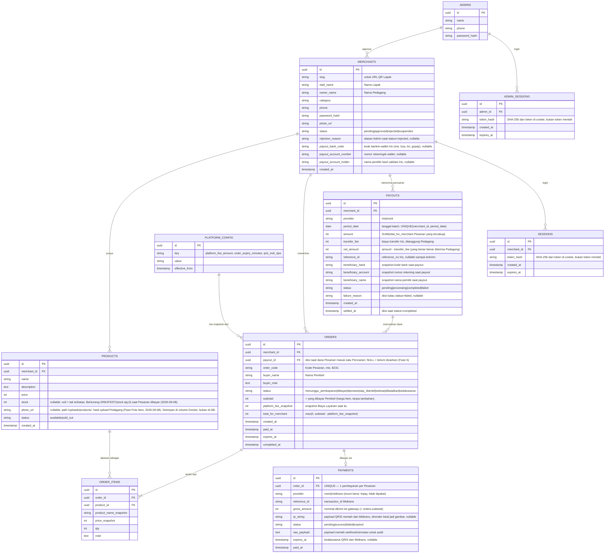

# Data Model

> Pemetaan istilah: lihat [GLOSSARY.md](GLOSSARY.md). Nama tabel di bawah pakai Bahasa Inggris (konvensi kode, lihat [CODING-STYLE.md](CODING-STYLE.md)) dengan komentar istilah Indonesia-nya.

## Diagram Relasi

## Catatan per Entitas

### `merchants` (Pedagang/Lapak)
- MVP asumsi **1 baris = 1 Pedagang = 1 Lapak** (lihat [PRD.md](PRD.md#5-di-luar-lingkup-mvp-out-of-scope--dicatat-sebagai-ide-masa-depan-di-backlogmd)). Kalau nanti butuh multi-Lapak per Pedagang, perlu migrasi memisahkan `merchants` (identitas Pedagang) dari `stalls` (Lapak) — jangan dilakukan sebelum benar-benar dibutuhkan (lihat [RULES.md](RULES.md#4-prioritas-desain)).
- `slug` dipakai di URL QR Lapak (`/menu/{slug}`), harus unik, dibuat otomatis dari `stall_name` + suffix acak jika bentrok.
- `status = pending` saat baru daftar; QR Lapak baru bisa diakses publik setelah `approved`.
- `password_hash`: hash password login Pedagang (nomor HP + password, lihat [TEKNOLOGI.md §Autentikasi](TEKNOLOGI.md#autentikasi)) — **tidak pernah** simpan plaintext, hash pakai algoritma lambat (mis. bcrypt/argon2) di server saat registrasi/ganti password.
- `rejection_reason` (nullable, Fase 4): diisi Admin **wajib** saat menolak pendaftaran (`status → rejected`), ditampilkan ke Pedagang saat mereka mencoba login supaya tidak perlu kontak terpisah untuk tahu alasannya. Direset ke `null` kalau Pedagang yang sama nantinya di-*approve* (dari status lain, lewat proses manual/masa depan).
- `payout_bank_code` / `payout_account_number` / `payout_account_holder` (nullable, Fase 6): **menggantikan** kolom lama `payout_account_info` (teks bebas). Diisi Pedagang di `/dashboard/profil`, `payout_account_holder` hasil `DisbursementProvider.validateBankAccount()` (Iris) — bukan diketik. Job Pencairan otomatis **melewati** Lapak yang ketiganya belum lengkap/tervalidasi (Admin lihat penanda di `/admin/merchants`).

### `admins`
- `password_hash`: sama seperti `merchants.password_hash`, dibuat manual oleh Admin lain lewat proses internal (bukan self-service).

### `products` (Item)
- `status = sold_out` dipakai Pedagang untuk menyembunyikan Item yang habis tanpa menghapus datanya (histori pesanan lama tetap valid lewat snapshot di `order_items`).

### `orders` (Pesanan)
- `order_code`: pendek & mudah disebutkan lisan (huruf+angka, mis. 4 karakter), **unik per hari per Lapak** (boleh berulang lintas hari/lintas Lapak) — cukup untuk kebutuhan verbal saat pengambilan, tidak perlu unik global.
- `platform_fee_snapshot`: **wajib** diisi dari nilai `platform_config` yang berlaku **saat Pesanan dibuat**, bukan dihitung ulang saat laporan ditarik — ini yang membuat histori tidak berubah kalau Admin ubah Biaya Layanan di kemudian hari (lihat [RULES.md](RULES.md#6-uang--konfigurasi-bisnis)).
- `expires_at` dihitung saat Pesanan dibuat = `created_at + order_expiry_minutes` (dari `platform_config`). Sebuah job/cron (atau pengecekan lazy saat halaman dibuka) mengubah status jadi `kedaluwarsa` jika lewat waktu & masih `menunggu_pembayaran`.
- `subtotal` = **persis yang dibayar Pembeli** (jumlah harga Item × qty). MDR QRIS **tidak** ditambahkan ke sini (dilarang dibebankan ke Pembeli — [ARSITEKTUR-SISTEM.md](ARSITEKTUR-SISTEM.md) ADR 2026-09-08); MDR ditanggung Aplikator di luar pembukuan per-Pesanan.
- `payout_id` (nullable, Fase 6): NULL selama dana Pesanan belum masuk Pencairan. Diisi oleh job Pencairan otomatis saat baris `payouts` dibuat. Order dengan `payout_id` terisi **tidak** ikut dihitung lagi di Saldo Pedagang. Kalau Pencairan gagal → di-*unlink* kembali ke NULL.

### `order_items`
- Menyimpan `product_name_snapshot` & `price_snapshot` supaya kalau Pedagang mengubah harga/nama Item di kemudian hari, histori Pesanan lama tidak ikut berubah.

### `payments`
- `provider = mock` untuk transaksi dev/test, `provider = midtrans` untuk staging/produksi (lihat [TEKNOLOGI.md](TEKNOLOGI.md#payment-provider--disbursement-provider-abstraction)). **Wajib** difilter/dipisah per `provider` di semua laporan keuangan, supaya uang "palsu" (mock) tidak tercampur perhitungan real. Enum lama `tripay` dibiarkan di definisi enum (tidak pernah dipakai) — tidak perlu migrasi menghapusnya.
- `gross_amount` = nominal yang dikirim ke gateway = `orders.subtotal`. Dicek cocok dengan `gross_amount` di payload webhook Midtrans sebagai bagian verifikasi `signature_key`.
- `qr_string` = payload QRIS mentah dari Midtrans; dirender jadi gambar **di server MyGerai** pakai lib `qrcode` (tidak mengambil gambar dari host Midtrans → tidak perlu `remotePatterns`). Untuk `MockPaymentProvider` boleh `null` (QR dummy digenerate langsung).
- `raw_payload` menyimpan payload mentah webhook (nyata) atau payload simulasi (mock) untuk audit/debug.

### `payouts` (Pencairan) — Fase 6: otomatis, bukan manual lagi
- **Dibuat oleh job Pencairan otomatis** (`POST /api/cron/disburse`, batch harian), **bukan** dicatat manual Admin. Pencairan manual **dihapus** (`/admin/payouts` jadi read-only). Lihat [ARSITEKTUR-SISTEM.md §Alur Data: Pencairan Otomatis](ARSITEKTUR-SISTEM.md#alur-data-pencairan-otomatis-ke-pedagang-model-b--fase-6).
- `UNIQUE(merchant_id, period_date)` — pengaman idempotensi: satu Lapak paling banyak satu batch Pencairan per hari, walau endpoint cron kepanggil dua kali.
- `amount` = `SUM(total_for_merchant)` dari Pesanan yang di-*link* (`orders.payout_id` di-set ke baris ini dalam transaksi yang sama). `transfer_fee` (dari respons Iris) **ditanggung Pedagang** → `net_amount = amount − transfer_fee` yang benar-benar diterima Pedagang.
- `beneficiary_*` = **snapshot** rekening tujuan saat Pencairan dibuat (kalau Pedagang ganti rekening kemudian, riwayat Pencairan lama tetap menunjukkan ke mana dulu uang dikirim).
- `status`: `pending` (baris dibuat, belum dikirim ke Iris) → `processing` (dikirim) → `completed` (callback Iris sukses, isi `settled_at`) / `failed` (isi `failure_reason`; Pesanan yang tadinya di-link di-*unlink* `payout_id = NULL` supaya ikut batch berikutnya). Enum lama `selesai` **diganti** `completed`+`processing`+`failed` (migrasi enum).
- **Saldo Pedagang** (istilah di [GLOSSARY.md](GLOSSARY.md)) — nilai turunan, sekarang: `SUM(orders.total_for_merchant WHERE status IN (dibayar, diproses, siap_diambil, selesai) AND payout_id IS NULL)` per Lapak = bagian yang **belum** masuk Pencairan mana pun. Tidak lagi pakai `SUM(orders) − SUM(payouts)` (rawan salah kalau ada payout `failed`/`processing`). Tidak perlu kolom saldo tersendiri.

### `platform_config` (Konfigurasi Aplikator)
- Disimpan sebagai key-value dengan riwayat (`effective_from`) supaya bisa dilacak kapan Biaya Layanan berubah — jangan **update in place**, tapi **insert baris baru** dan pakai baris dengan `effective_from` terbaru yang `<= now()` sebagai nilai aktif.
- Key: `platform_fee_amount` (default `1000`), `order_expiry_minutes` (default `15`), `qris_mdr_bps` (Fase 6, default `70` = 0,70%) — MDR **tidak** memengaruhi kalkulasi Pesanan (ditanggung Aplikator); dipakai **hanya** untuk mengestimasi margin bersih Aplikator (`Biaya Layanan − estimasi MDR`) di laporan `/admin/payouts`.

### `sessions` (Sesi login Pedagang — Fase 3)
- Mekanisme konkret dari "identitas Pedagang dari sesi" yang disebut di §Keamanan Multi-tenant di bawah — lihat implementasi di `src/lib/auth/session.ts`.
- `token_hash`: **SHA-256 dari token bearer acak** (32 byte) yang disimpan di cookie `HttpOnly` klien — token mentah **tidak pernah** disimpan di DB, supaya kebocoran baris tabel ini tidak otomatis jadi kebocoran sesi aktif.
- Tidak ada job cleanup baris kedaluwarsa — sama seperti filosofi kedaluwarsa Pesanan ([ARSITEKTUR-SISTEM.md](ARSITEKTUR-SISTEM.md#kedaluwarsa-pesanan)): cukup difilter `expires_at > now()` saat dibaca (lazy), volume rendah di skala MVP.
- Logout = hapus baris (bukan cuma hapus cookie klien) — sesi benar-benar revoked di server.

### `admin_sessions` (Sesi login Admin — Fase 4)
- Tabel **terpisah** dari `sessions` (bukan tabel polimorfik dengan kolom nullable) — `merchants`/`admins` sudah sengaja dipisah sejak awal (bukan `users`+role tunggal), jadi sesi mereka juga dipisah supaya tidak butuh `CHECK` constraint tambahan untuk dua domain yang memang berbeda. Mekanisme identik `sessions` (token bearer acak di-hash SHA-256, cookie `HttpOnly` terpisah bernama `mygerai_admin_session` — beda dari `mygerai_session` Pedagang supaya keduanya bisa aktif berdampingan di browser yang sama). Lihat implementasi di `src/lib/auth/admin-session.ts`.
- Admin **tidak** punya gate status seperti `merchants.status === "approved"` — begitu password cocok, sesi langsung dibuat (Admin = akun internal, dibuat manual, lihat [TEKNOLOGI.md §Autentikasi](TEKNOLOGI.md#autentikasi)).

## Keamanan Multi-tenant (Isolasi Level Aplikasi)

> **Perubahan arsitektur (2026-09-05):** MyGerai pindah dari rencana awal Supabase Cloud ke **PostgreSQL self-hosted** (server Garuda milik User, lewat Dokploy + Cloudflare Tunnel — lihat ADR di [ARSITEKTUR-SISTEM.md](ARSITEKTUR-SISTEM.md)). Konsekuensinya: tidak ada lagi PostgREST/`anon`/`authenticated` role yang membuat browser bisa konek langsung ke database seperti model Supabase — **satu-satunya jalur ke database adalah kode server tepercaya** (Server Action & Route Handler Next.js, pakai satu koneksi Postgres dengan hak akses penuh). Karena itu isolasi antar Lapak **tidak lagi ditegakkan lewat Row Level Security**, tapi wajib ditegakkan di kode aplikasi. Bagian ini menggantikan pendekatan RLS yang sebelumnya direncanakan di sini.

Aturan wajib (ground truth, jangan diubah tanpa update dokumen ini):
- Setiap fungsi di `src/server/*.ts` (Server Action) yang membaca/menulis `products`, `orders`, `order_items`, atau `payments` milik Pedagang **wajib** menerima identitas Pedagang yang sedang login dari sesi (bukan dari parameter yang dikirim klien) dan memfilter query dengan `WHERE merchant_id = <id dari sesi>` — **tidak boleh** ada query ke tabel-tabel ini tanpa filter kepemilikan eksplisit.
- Endpoint/Server Action yang dipanggil Pembeli (tanpa akun) hanya boleh: `SELECT` `products` berstatus `available` milik satu Lapak yang sedang dibuka (dari `slug` di URL), dan `INSERT` ke `orders`/`order_items` dengan `merchant_id` & harga yang divalidasi ulang di server (lihat [ARSITEKTUR-SISTEM.md](ARSITEKTUR-SISTEM.md)) — tidak pernah `SELECT` bebas ke seluruh tabel `orders`.
- Halaman status Pesanan Pembeli (`/pesanan/[orderId]`) mengandalkan `orders.id` (UUID v4, praktis tidak bisa ditebak) sebagai "kredensial" akses — di-query langsung by primary key lewat Server Component/Route Handler, tanpa perlu akun/token tambahan. Ini aman *karena* Pembeli tidak pernah konek langsung ke database (tidak ada risiko enumerasi lewat client DB access seperti model Supabase `anon` key).
- Hanya Server Action bertanda "Admin" (dicek dari sesi login Admin lewat `getAdminSession()`) yang boleh membaca/menulis `platform_config` dan `payouts`, serta approve/reject `merchants` — diimplementasikan di `src/server/{config,payouts,merchants}.ts` sejak Fase 4. Pengecualian: `getActivePlatformConfig()` sengaja tanpa gate Admin karena dipakai bareng alur checkout Pembeli dan tidak mengembalikan data sensitif.
- **Route Handler tanpa sesi (Fase 6)** — diautentikasi lewat cara lain, bukan cookie:
  - `POST /api/webhooks/payment` & `/api/webhooks/payout`: **wajib** verifikasi keaslian (Midtrans `signature_key` = `SHA512(order_id+status_code+gross_amount+ServerKey)`; Iris signature/challenge) **sebelum** menyentuh DB. Payload webhook = data tak tepercaya sampai terverifikasi ([RULES §7.2](RULES.md#7-keamanan)).
  - `POST /api/cron/disburse`: **wajib** cek header `Authorization: Bearer $CRON_SECRET` (konstanta env, dibandingkan `timingSafeEqual`). Tanpa itu → `401`, tidak menjalankan apa pun.
  - Ketiganya menulis `orders`/`payments`/`payouts` **lintas semua Lapak** (bukan difilter satu sesi) — justru karena itu autentikasi non-sesi di atas jadi satu-satunya gerbang; jangan tambah query tanpa memastikan gerbang itu lolos dulu.
- Data sensitif (`password_hash`, token, `MIDTRANS_SERVER_KEY`, `IRIS_API_KEY`, `CRON_SECRET`, dsb) **tidak pernah** ikut ter-return dari Server Action / Route Handler ke klien — mapping ke tipe hasil yang eksplisit (lihat [CODING-STYLE.md §Struktur Fungsi Server Action](CODING-STYLE.md#struktur-fungsi-server-action)).

**Kenapa bukan RLS lagi:** RLS Postgres bernilai tinggi ketika klien (browser) bisa konek langsung ke database dengan role terbatas (model Supabase `anon`/`authenticated` + PostgREST/Realtime) — di situ RLS jadi lapisan pertahanan utama. Di arsitektur self-hosted ini, browser **tidak pernah** menyentuh database sama sekali (Realtime pun lewat polling/SSE dari Route Handler, lihat [ARSITEKTUR-SISTEM.md](ARSITEKTUR-SISTEM.md)), jadi satu-satunya permukaan yang perlu diamankan adalah kode server itu sendiri. Menambah RLS di atas ini hanya menambah kompleksitas (perlu `SET LOCAL` session variable tiap koneksi) tanpa mengurangi risiko nyata — bertentangan dengan prinsip KISS ([RULES.md §4](RULES.md#4-prioritas-desain)). Kalau nanti skala membesar dan tim bertambah (risiko bug "lupa filter" naik), pertimbangkan lagi menambah RLS sebagai lapisan kedua.
