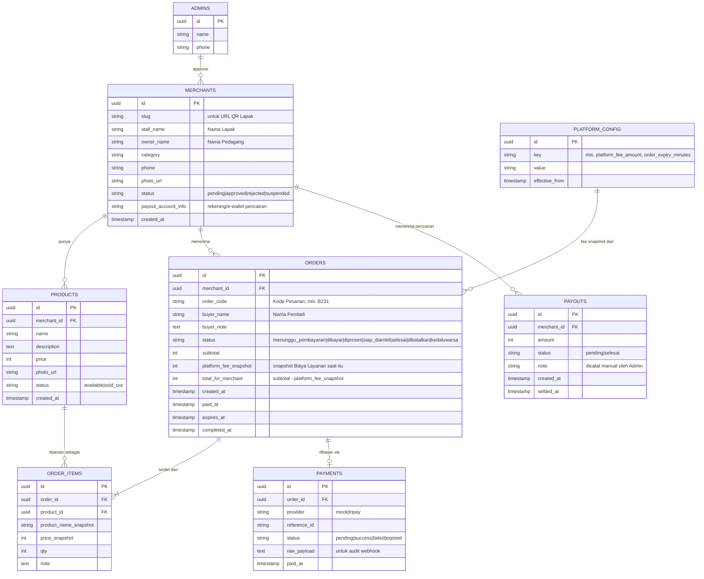

# Data Model

> Pemetaan istilah: lihat [GLOSSARY.md](GLOSSARY.md). Nama tabel di bawah pakai Bahasa Inggris (konvensi kode, lihat [CODING-STYLE.md](CODING-STYLE.md)) dengan komentar istilah Indonesia-nya.

## Diagram Relasi

## Catatan per Entitas

### `merchants` (Pedagang/Lapak)
- MVP asumsi **1 baris = 1 Pedagang = 1 Lapak** (lihat [PRD.md](PRD.md#5-di-luar-lingkup-mvp-out-of-scope--dicatat-sebagai-ide-masa-depan-di-backlogmd)). Kalau nanti butuh multi-Lapak per Pedagang, perlu migrasi memisahkan `merchants` (identitas Pedagang) dari `stalls` (Lapak) — jangan dilakukan sebelum benar-benar dibutuhkan (lihat [RULES.md](RULES.md#4-prioritas-desain)).
- `slug` dipakai di URL QR Lapak (`/menu/{slug}`), harus unik, dibuat otomatis dari `stall_name` + suffix acak jika bentrok.
- `status = pending` saat baru daftar; QR Lapak baru bisa diakses publik setelah `approved`.

### `products` (Item)
- `status = sold_out` dipakai Pedagang untuk menyembunyikan Item yang habis tanpa menghapus datanya (histori pesanan lama tetap valid lewat snapshot di `order_items`).

### `orders` (Pesanan)
- `order_code`: pendek & mudah disebutkan lisan (huruf+angka, mis. 4 karakter), **unik per hari per Lapak** (boleh berulang lintas hari/lintas Lapak) — cukup untuk kebutuhan verbal saat pengambilan, tidak perlu unik global.
- `platform_fee_snapshot`: **wajib** diisi dari nilai `platform_config` yang berlaku **saat Pesanan dibuat**, bukan dihitung ulang saat laporan ditarik — ini yang membuat histori tidak berubah kalau Admin ubah Biaya Layanan di kemudian hari (lihat [RULES.md](RULES.md#6-uang--konfigurasi-bisnis)).
- `expires_at` dihitung saat Pesanan dibuat = `created_at + order_expiry_minutes` (dari `platform_config`). Sebuah job/cron (atau pengecekan lazy saat halaman dibuka) mengubah status jadi `kedaluwarsa` jika lewat waktu & masih `menunggu_pembayaran`.

### `order_items`
- Menyimpan `product_name_snapshot` & `price_snapshot` supaya kalau Pedagang mengubah harga/nama Item di kemudian hari, histori Pesanan lama tidak ikut berubah.

### `payments`
- `provider = mock` untuk semua transaksi di tahap MVP awal (lihat [TEKNOLOGI.md](TEKNOLOGI.md#payment-provider-abstraction)). **Wajib** difilter/dipisah dari `provider = tripay` di semua laporan keuangan begitu integrasi nyata aktif, supaya tidak ada uang "palsu" tercampur perhitungan real.
- `raw_payload` menyimpan payload mentah webhook (nyata) atau payload simulasi (mock) untuk keperluan audit/debug.

### `payouts` (Pencairan)
- MVP: dicatat **manual** oleh Admin setelah transfer dilakukan di luar sistem (lihat [PRD.md](PRD.md#61-alur-admin)). Bukan hasil pemanggilan API disbursement — itu masuk fase lanjutan (lihat [BACKLOG.md](BACKLOG.md)).
- **Saldo Pedagang** (istilah di [GLOSSARY.md](GLOSSARY.md)) adalah nilai turunan, dihitung sebagai: `SUM(orders.total_for_merchant WHERE status IN (dibayar, diproses, siap_diambil, selesai)) - SUM(payouts.amount WHERE status = selesai)`. Tidak perlu kolom saldo tersendiri yang bisa out-of-sync.

### `platform_config` (Konfigurasi Aplikator)
- Disimpan sebagai key-value dengan riwayat (`effective_from`) supaya bisa dilacak kapan Biaya Layanan berubah — jangan **update in place**, tapi **insert baris baru** dan pakai baris dengan `effective_from` terbaru yang `<= now()` sebagai nilai aktif.
- Key minimal MVP: `platform_fee_amount` (default `1000`), `order_expiry_minutes` (default `15`).

## Keamanan Multi-tenant (Row Level Security)

Karena satu database melayani banyak Pedagang sekaligus, **wajib** aktifkan Row Level Security (RLS) di Supabase Postgres:
- Pedagang hanya boleh `SELECT`/`UPDATE` baris `products` dan `orders` milik `merchant_id` = dirinya sendiri.
- Pembeli (tanpa akun, akses via `anon` key) hanya boleh `SELECT` `products` yang `status = available` milik Lapak yang sedang dibuka, dan hanya boleh `INSERT` ke `orders`/`order_items` miliknya sendiri (dibatasi lewat token/session pendek per Pesanan, bukan akses bebas ke seluruh tabel `orders`).
- Admin (role terpisah) satu-satunya yang boleh akses `platform_config` dan `payouts`.

Detail implementasi RLS policy ditulis saat coding, tapi **aturan** di atas ini bagian dari ground truth — jangan diubah tanpa update dokumen ini.
