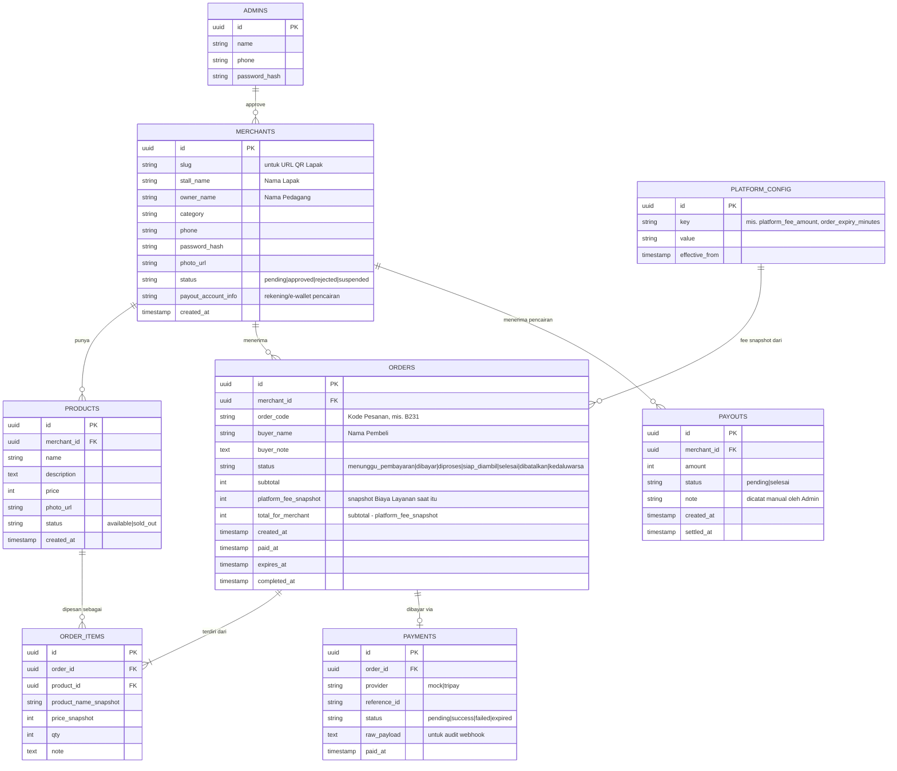

# Data Model

> Pemetaan istilah: lihat [GLOSSARY.md](GLOSSARY.md). Nama tabel di bawah pakai Bahasa Inggris (konvensi kode, lihat [CODING-STYLE.md](CODING-STYLE.md)) dengan komentar istilah Indonesia-nya.

## Diagram Relasi

## Catatan per Entitas

### `merchants` (Pedagang/Lapak)
- MVP asumsi **1 baris = 1 Pedagang = 1 Lapak** (lihat [PRD.md](PRD.md#5-di-luar-lingkup-mvp-out-of-scope--dicatat-sebagai-ide-masa-depan-di-backlogmd)). Kalau nanti butuh multi-Lapak per Pedagang, perlu migrasi memisahkan `merchants` (identitas Pedagang) dari `stalls` (Lapak) — jangan dilakukan sebelum benar-benar dibutuhkan (lihat [RULES.md](RULES.md#4-prioritas-desain)).
- `slug` dipakai di URL QR Lapak (`/menu/{slug}`), harus unik, dibuat otomatis dari `stall_name` + suffix acak jika bentrok.
- `status = pending` saat baru daftar; QR Lapak baru bisa diakses publik setelah `approved`.
- `password_hash`: hash password login Pedagang (nomor HP + password, lihat [TEKNOLOGI.md §Autentikasi](TEKNOLOGI.md#autentikasi)) — **tidak pernah** simpan plaintext, hash pakai algoritma lambat (mis. bcrypt/argon2) di server saat registrasi/ganti password.

### `admins`
- `password_hash`: sama seperti `merchants.password_hash`, dibuat manual oleh Admin lain lewat proses internal (bukan self-service).

### `products` (Item)
- `status = sold_out` dipakai Pedagang untuk menyembunyikan Item yang habis tanpa menghapus datanya (histori pesanan lama tetap valid lewat snapshot di `order_items`).

### `orders` (Pesanan)
- `order_code`: pendek & mudah disebutkan lisan (huruf+angka, mis. 4 karakter), **unik per hari per Lapak** (boleh berulang lintas hari/lintas Lapak) — cukup untuk kebutuhan verbal saat pengambilan, tidak perlu unik global.
- `platform_fee_snapshot`: **wajib** diisi dari nilai `platform_config` yang berlaku **saat Pesanan dibuat**, bukan dihitung ulang saat laporan ditarik — ini yang membuat histori tidak berubah kalau Admin ubah Biaya Layanan di kemudian hari (lihat [RULES.md](RULES.md#6-uang--konfigurasi-bisnis)).
- `expires_at` dihitung saat Pesanan dibuat = `created_at + order_expiry_minutes` (dari `platform_config`). Sebuah job/cron (atau pengecekan lazy saat halaman dibuka) mengubah status jadi `kedaluwarsa` jika lewat waktu & masih `menunggu_pembayaran`.

### `order_items`
- Menyimpan `product_name_snapshot` & `price_snapshot` supaya kalau Pedagang mengubah harga/nama Item di kemudian hari, histori Pesanan lama tidak ikut berubah.

### `payments`
- `provider = mock` untuk semua transaksi di tahap MVP awal (lihat [TEKNOLOGI.md](TEKNOLOGI.md#payment-provider-abstraction)). **Wajib** difilter/dipisah dari `provider = tripay` di semua laporan keuangan begitu integrasi nyata aktif, supaya tidak ada uang "palsu" tercampur perhitungan real.
- `raw_payload` menyimpan payload mentah webhook (nyata) atau payload simulasi (mock) untuk keperluan audit/debug.

### `payouts` (Pencairan)
- MVP: dicatat **manual** oleh Admin setelah transfer dilakukan di luar sistem (lihat [PRD.md](PRD.md#61-alur-admin)). Bukan hasil pemanggilan API disbursement — itu masuk fase lanjutan (lihat [BACKLOG.md](BACKLOG.md)).
- **Saldo Pedagang** (istilah di [GLOSSARY.md](GLOSSARY.md)) adalah nilai turunan, dihitung sebagai: `SUM(orders.total_for_merchant WHERE status IN (dibayar, diproses, siap_diambil, selesai)) - SUM(payouts.amount WHERE status = selesai)`. Tidak perlu kolom saldo tersendiri yang bisa out-of-sync.

### `platform_config` (Konfigurasi Aplikator)
- Disimpan sebagai key-value dengan riwayat (`effective_from`) supaya bisa dilacak kapan Biaya Layanan berubah — jangan **update in place**, tapi **insert baris baru** dan pakai baris dengan `effective_from` terbaru yang `<= now()` sebagai nilai aktif.
- Key minimal MVP: `platform_fee_amount` (default `1000`), `order_expiry_minutes` (default `15`).

## Keamanan Multi-tenant (Isolasi Level Aplikasi)

> **Perubahan arsitektur (2026-09-05):** MyGerai pindah dari rencana awal Supabase Cloud ke **PostgreSQL self-hosted** (server Garuda milik User, lewat Dokploy + Cloudflare Tunnel — lihat ADR di [ARSITEKTUR-SISTEM.md](ARSITEKTUR-SISTEM.md)). Konsekuensinya: tidak ada lagi PostgREST/`anon`/`authenticated` role yang membuat browser bisa konek langsung ke database seperti model Supabase — **satu-satunya jalur ke database adalah kode server tepercaya** (Server Action & Route Handler Next.js, pakai satu koneksi Postgres dengan hak akses penuh). Karena itu isolasi antar Lapak **tidak lagi ditegakkan lewat Row Level Security**, tapi wajib ditegakkan di kode aplikasi. Bagian ini menggantikan pendekatan RLS yang sebelumnya direncanakan di sini.

Aturan wajib (ground truth, jangan diubah tanpa update dokumen ini):
- Setiap fungsi di `src/server/*.ts` (Server Action) yang membaca/menulis `products`, `orders`, `order_items`, atau `payments` milik Pedagang **wajib** menerima identitas Pedagang yang sedang login dari sesi (bukan dari parameter yang dikirim klien) dan memfilter query dengan `WHERE merchant_id = <id dari sesi>` — **tidak boleh** ada query ke tabel-tabel ini tanpa filter kepemilikan eksplisit.
- Endpoint/Server Action yang dipanggil Pembeli (tanpa akun) hanya boleh: `SELECT` `products` berstatus `available` milik satu Lapak yang sedang dibuka (dari `slug` di URL), dan `INSERT` ke `orders`/`order_items` dengan `merchant_id` & harga yang divalidasi ulang di server (lihat [ARSITEKTUR-SISTEM.md](ARSITEKTUR-SISTEM.md)) — tidak pernah `SELECT` bebas ke seluruh tabel `orders`.
- Halaman status Pesanan Pembeli (`/pesanan/[orderId]`) mengandalkan `orders.id` (UUID v4, praktis tidak bisa ditebak) sebagai "kredensial" akses — di-query langsung by primary key lewat Server Component/Route Handler, tanpa perlu akun/token tambahan. Ini aman *karena* Pembeli tidak pernah konek langsung ke database (tidak ada risiko enumerasi lewat client DB access seperti model Supabase `anon` key).
- Hanya Server Action bertanda "Admin" (dicek dari sesi login Admin) yang boleh membaca/menulis `platform_config` dan `payouts`.
- Data sensitif (`password_hash`, dsb) **tidak pernah** ikut ter-return dari Server Action ke klien — mapping ke tipe hasil yang eksplisit (lihat [CODING-STYLE.md §Struktur Fungsi Server Action](CODING-STYLE.md#struktur-fungsi-server-action)).

**Kenapa bukan RLS lagi:** RLS Postgres bernilai tinggi ketika klien (browser) bisa konek langsung ke database dengan role terbatas (model Supabase `anon`/`authenticated` + PostgREST/Realtime) — di situ RLS jadi lapisan pertahanan utama. Di arsitektur self-hosted ini, browser **tidak pernah** menyentuh database sama sekali (Realtime pun lewat polling/SSE dari Route Handler, lihat [ARSITEKTUR-SISTEM.md](ARSITEKTUR-SISTEM.md)), jadi satu-satunya permukaan yang perlu diamankan adalah kode server itu sendiri. Menambah RLS di atas ini hanya menambah kompleksitas (perlu `SET LOCAL` session variable tiap koneksi) tanpa mengurangi risiko nyata — bertentangan dengan prinsip KISS ([RULES.md §4](RULES.md#4-prioritas-desain)). Kalau nanti skala membesar dan tim bertambah (risiko bug "lupa filter" naik), pertimbangkan lagi menambah RLS sebagai lapisan kedua.
