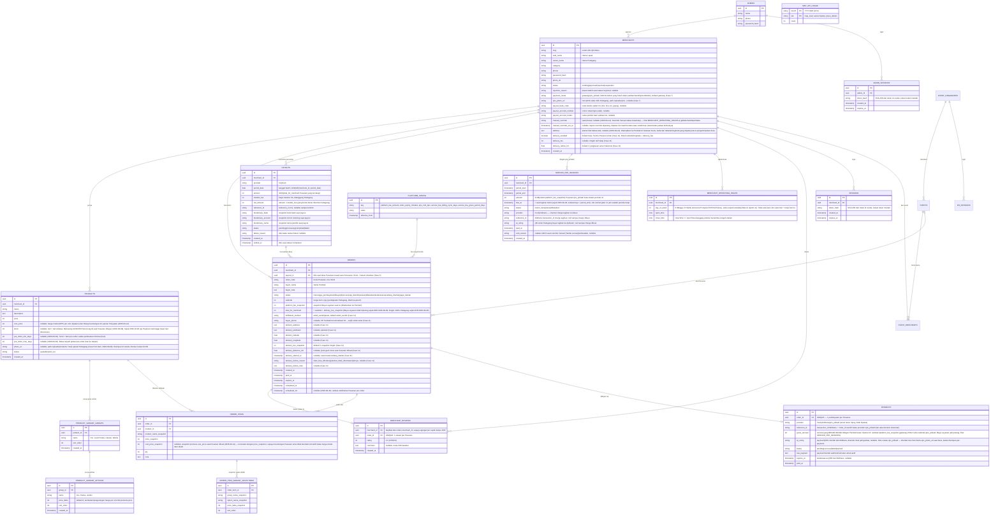

# Data Model

> Pemetaan istilah: lihat [GLOSSARY.md](GLOSSARY.md). Nama tabel di bawah pakai Bahasa Inggris (konvensi kode, lihat [CODING-STYLE.md](CODING-STYLE.md)) dengan komentar istilah Indonesia-nya.

## Diagram Relasi

```mermaid
erDiagram
    ADMINS ||--o{ MERCHANTS : "approve"
    MERCHANTS ||--o{ PRODUCTS : "punya"
    MERCHANTS ||--o{ ORDERS : "menerima"
    MERCHANTS ||--o{ PAYOUTS : "menerima pencairan"
    MERCHANTS ||--o{ SERVICE_FEE_INVOICES : "ditagih (qris_pribadi)"
    MERCHANTS ||--o{ MERCHANT_OPERATING_HOURS : "jadwal buka"
    MERCHANTS ||--o{ MERCHANT_REVIEWS : "diulas"
    ORDERS ||--o| MERCHANT_REVIEWS : "diulas (maks 1)"
    PRODUCTS ||--o{ PRODUCT_VARIANT_GROUPS : "punya grup varian"
    PRODUCT_VARIANT_GROUPS ||--|{ PRODUCT_VARIANT_OPTIONS : "punya pilihan"
    ORDERS ||--|{ ORDER_ITEMS : "terdiri dari"
    PRODUCTS ||--o{ ORDER_ITEMS : "dipesan sebagai"
    ORDER_ITEMS ||--o{ ORDER_ITEM_VARIANT_SELECTIONS : "snapshot varian dipilih"
    ORDERS ||--o| PAYMENTS : "dibayar via"
    PAYOUTS ||--o{ ORDERS : "mencairkan dana"
    PLATFORM_CONFIG ||--o{ ORDERS : "fee snapshot dari"
    MERCHANTS ||--o{ SESSIONS : "login"
    ADMINS ||--o{ ADMIN_SESSIONS : "login"
    EVENT_ORGANIZERS ||--o{ EVENTS : "membuat"
    EVENT_ORGANIZERS ||--o{ EO_SESSIONS : "login"
    EVENTS ||--o{ EVENT_MERCHANTS : "berisi Gerai"
    MERCHANTS ||--o{ EVENT_MERCHANTS : "ikut event"
    EVENTS |o--o{ ORDERS : "asal Pesanan"

    MERCHANTS {
        uuid id PK
        string slug "untuk URL QR Menu"
        string stall_name "Nama Lapak"
        string owner_name "Nama Pedagang"
        string category
        string phone
        string password_hash
        string photo_url
        string status "pending|approved|rejected|suspended"
        string rejection_reason "alasan Admin saat status=rejected, nullable"
        string payment_mode "gateway|qris_pribadi. HANYA Admin yang boleh ubah (setMerchantPaymentMode), default gateway (Fase 7)"
        string qris_photo_url "foto QRIS statis milik Pedagang, path /uploads/qris/<uuid>.<ext>, nullable (Fase 7)"
        string payout_bank_code "kode bank/e-wallet Iris (mis. bca, bri, gopay), nullable"
        string payout_account_number "nomor rekening/e-wallet, nullable"
        string payout_account_holder "nama pemilik hasil validasi Iris, nullable"
        string manual_override "open|closed, nullable (2026-09-14). Override manual status buka/tutup — lihat MERCHANT_OPERATING_HOURS & getMerchantOpenState."
        timestamp manual_override_set_at "nullable; kapan override dipasang, dipakai cek masih berlaku atau sudah basi (lewat batas jadwal berikutnya)"
        text address "alamat fisik bebas-teks, nullable (2026-09-21). Ditampilkan ke Pembeli di halaman menu, beda dari latitude/longitude yang dipakai peta & pengelompokan Area."
        boolean delivery_enabled "default false; Terima Pesanan Antar (Fase 11). Butuh latitude/longitude + delivery_fee"
        int delivery_fee "nullable; Ongkir tarif tetap (Fase 11)"
        float delivery_radius_km "default 3; jangkauan antar maksimal (Fase 11)"
        timestamp created_at
    }

    MERCHANT_OPERATING_HOURS {
        uuid id PK
        uuid merchant_id FK
        int day_of_week "0=Minggu..6=Sabtu (konvensi Postgres EXTRACT(dow), sama seperti weekdayStats di reports.ts). Tidak ada baris utk suatu hari = tutup hari itu."
        time open_time
        time close_time "closeTime <= openTime dianggap jendela menembus tengah malam"
    }

    MERCHANT_REVIEWS {
        uuid id PK
        uuid merchant_id FK "duplikat dari orders.merchant_id, supaya agregat per Lapak tanpa JOIN"
        uuid order_id FK "UNIQUE: 1 ulasan per Pesanan"
        int rating "1-5 (CHECK)"
        text comment "nullable, maks 500 karakter"
        timestamp created_at
    }

    PRODUCTS {
        uuid id PK
        uuid merchant_id FK
        string name
        text description
        int price
        int cost_price "nullable; harga modal (HPP) per unit, dipakai untuk hitung Keuntungan di Laporan Penjualan (2026-09-14)"
        int stock "nullable; null = tak terbatas. Berkurang GREATEST(stock-qty,0) saat Pesanan dibayar (2026-09-08). Sejak 2026-10-05 qty Pesanan menunggu bayar ikut direservasi."
        int pre_order_min_days "nullable (2026-09-30). Terisi = Item pre-order: waktu pembuatan minimal (hari)."
        int pre_order_max_days "nullable (2026-09-30). Batas terjauh jadwal pre-order (hari ke depan)."
        string photo_url "nullable; path /uploads/products/<uuid>.<ext> hasil upload Pedagang (Fase Foto Item, 2026-09-08). Disimpan di volume Docker, bukan di DB."
        string status "available|sold_out"
        timestamp created_at
    }

    PRODUCT_VARIANT_GROUPS {
        uuid id PK
        uuid product_id FK
        string name "mis. Level Pedas, Ukuran, Warna"
        int sort_order
        timestamp created_at
    }

    PRODUCT_VARIANT_OPTIONS {
        uuid id PK
        uuid group_id FK
        string name "mis. Pedas, Jumbo"
        int price_delta "default 0; tambahan/pengurangan harga per unit thd products.price"
        int sort_order
        timestamp created_at
    }

    ORDERS {
        uuid id PK
        uuid merchant_id FK
        uuid payout_id FK "diisi saat dana Pesanan masuk satu Pencairan; NULL = belum dicairkan (Fase 6)"
        string order_code "Kode Pesanan, mis. B231"
        string buyer_name "Nama Pembeli"
        text buyer_note
        string status "menunggu_pembayaran|dibayar|diproses|siap_diambil|selesai|dibatalkan|kedaluwarsa|sedang_diantar|gagal_diantar"
        int subtotal "harga Item x qty (pendapatan Pedagang, diterima penuh)"
        int platform_fee_snapshot "snapshot Biaya Layanan saat itu (dibebankan ke Pembeli)"
        int total_for_merchant "= subtotal + delivery_fee_snapshot (Biaya Layanan tidak dipotong sejak ADR 2026-09-09; Ongkir 100% Pedagang sejak ADR 2026-09-28)"
        string fulfillment_method "ambil_sendiri|antar, default ambil_sendiri (Fase 11)"
        string buyer_phone "nullable; HP Pembeli ternormalisasi 62..., wajib untuk antar (Fase 11)"
        text delivery_address "nullable (Fase 11)"
        text delivery_landmark "nullable; patokan (Fase 11)"
        float delivery_latitude "nullable (Fase 11)"
        float delivery_longitude "nullable (Fase 11)"
        int delivery_fee_snapshot "default 0; snapshot Ongkir (Fase 11)"
        float delivery_distance_km "nullable; jarak garis lurus saat Pesanan dibuat (Fase 11)"
        timestamp delivery_started_at "nullable; saat masuk sedang_diantar (Fase 11)"
        string delivery_failure_reason "tidak_bisa_dihubungi|alamat_tidak_ditemukan|lainnya, nullable (Fase 11)"
        text delivery_failure_note "nullable (Fase 11)"
        timestamp created_at
        timestamp paid_at
        timestamp expires_at
        timestamp completed_at
        timestamp scheduled_for "nullable (2026-09-30). Jadwal ambil/antar Pesanan pre-order."
    }

    ORDER_ITEMS {
        uuid id PK
        uuid order_id FK
        uuid product_id FK
        string product_name_snapshot
        int price_snapshot
        int cost_price_snapshot "nullable; snapshot products.cost_price saat Pesanan dibuat (2026-09-14) — konsisten dengan price_snapshot, supaya Keuntungan Pesanan lama tidak berubah retroaktif kalau harga modal Item diedit"
        int qty
        text note
    }

    ORDER_ITEM_VARIANT_SELECTIONS {
        uuid id PK
        uuid order_item_id FK
        string group_name_snapshot
        string option_name_snapshot
        int price_delta_snapshot
        int sort_order
    }

    PAYMENTS {
        uuid id PK
        uuid order_id FK "UNIQUE — 1 pembayaran per Pesanan"
        string provider "mock|midtrans|qris_pribadi (enum lama: tripay, tidak dipakai)"
        string reference_id "transaction_id Midtrans; = order_id sendiri kalau provider=qris_pribadi (tak ada referensi eksternal)"
        int gross_amount "nominal yang BENAR-BENAR dibayar Pembeli lewat channel ini: subtotal+platform_fee_snapshot (gateway) ATAU cuma subtotal (qris_pribadi, Biaya Layanan jadi piutang, lihat SERVICE_FEE_INVOICES)"
        string qr_string "payload QRIS mentah dari Midtrans, dirender lokal jadi gambar, nullable. NULL kalau qris_pribadi — dirender dari merchants.qris_photo_url saat baca, bukan disimpan per-payment"
        string status "pending|success|failed|expired"
        text raw_payload "payload mentah webhook/simulasi untuk audit"
        timestamp expires_at "kedaluwarsa QRIS dari Midtrans, nullable"
        timestamp paid_at
    }

    PAYOUTS {
        uuid id PK
        uuid merchant_id FK
        string provider "iris|mock"
        date period_date "tanggal batch; UNIQUE(merchant_id, period_date)"
        int amount "SUM(total_for_merchant Pesanan yang tercakup)"
        int transfer_fee "biaya transfer Iris, ditanggung Pedagang"
        int net_amount "amount - transfer_fee (yang benar-benar diterima Pedagang)"
        string reference_id "reference_no Iris, nullable sampai terkirim"
        string beneficiary_bank "snapshot kode bank saat payout"
        string beneficiary_account "snapshot nomor rekening saat payout"
        string beneficiary_name "snapshot nama pemilik saat payout"
        string status "pending|processing|completed|failed"
        string failure_reason "diisi kalau status=failed, nullable"
        timestamp created_at
        timestamp settled_at "diisi saat status=completed"
    }

    SERVICE_FEE_INVOICES {
        uuid id PK
        uuid merchant_id FK
        timestamp period_start
        timestamp period_end
        int amount "SUM(orders.platform_fee_snapshot) Pesanan qris_pribadi lunas dalam periode ini"
        timestamp due_at "= saat tagihan terbit (sejak 2026-09-30; sebelumnya = period_end). Job normal jalan ±1 jam setelah periode tutup"
        string status "belum_lunas|lunas|dibatalkan"
        string provider "mock|midtrans — channel charge tagihan ini dibuat"
        string reference_id "Midtrans transaction_id charge tagihan; null sampai charge dibuat"
        string qr_string "QR untuk Pedagang bayar tagihan ke Aplikator; null sampai charge dibuat"
        timestamp paid_at
        string void_reason "catatan Admin saat override manual (Tandai Lunas)/pembatalan, nullable"
        timestamp created_at
    }

    PLATFORM_CONFIG {
        uuid id PK
        string key "platform_fee_amount, order_expiry_minutes, qris_mdr_bps, service_fee_billing_cycle_days, service_fee_grace_period_days"
        string value
        timestamp effective_from
    }

    ADMINS {
        uuid id PK
        string name
        string phone
        string password_hash
    }

    SESSIONS {
        uuid id PK
        uuid merchant_id FK
        string token_hash "SHA-256 dari token di cookie, bukan token mentah"
        timestamp created_at
        timestamp expires_at
    }

    ADMIN_SESSIONS {
        uuid id PK
        uuid admin_id FK
        string token_hash "SHA-256 dari token di cookie, bukan token mentah"
        timestamp created_at
        timestamp expires_at
    }

    MAP_API_USAGE {
        string month PK "YYYY-MM (UTC)"
        string sku PK "map_load, autocomplete, place_details"
        int count
    }
```

## Catatan per Entitas

### `merchants` (Pedagang/Lapak)
- MVP asumsi **1 baris = 1 Pedagang = 1 Lapak** (lihat [PRD.md](PRD.md#5-di-luar-lingkup-mvp-out-of-scope--dicatat-sebagai-ide-masa-depan-di-backlogmd)). Kalau nanti butuh multi-Lapak per Pedagang, perlu migrasi memisahkan `merchants` (identitas Pedagang) dari `stalls` (Lapak) — jangan dilakukan sebelum benar-benar dibutuhkan (lihat [RULES.md](RULES.md#4-prioritas-desain)).
- `slug` dipakai di URL QR Menu (`/menu/{slug}`), harus unik, dibuat otomatis dari `stall_name` + suffix acak jika bentrok.
- `status = pending` saat baru daftar; QR Menu baru bisa diakses publik setelah `approved`.
- `password_hash`: hash password login Pedagang (nomor HP + password, lihat [TEKNOLOGI.md §Autentikasi](TEKNOLOGI.md#autentikasi)) — **tidak pernah** simpan plaintext, hash pakai algoritma lambat (mis. bcrypt/argon2) di server saat registrasi/ganti password.
- `rejection_reason` (nullable, Fase 4): diisi Admin **wajib** saat menolak pendaftaran (`status → rejected`), ditampilkan ke Pedagang saat mereka mencoba login supaya tidak perlu kontak terpisah untuk tahu alasannya. Direset ke `null` kalau Pedagang yang sama nantinya di-*approve* (dari status lain, lewat proses manual/masa depan).
- `payout_bank_code` / `payout_account_number` / `payout_account_holder` (nullable, Fase 6): **menggantikan** kolom lama `payout_account_info` (teks bebas). Diisi Pedagang di `/dashboard/profil`, `payout_account_holder` hasil `DisbursementProvider.validateBankAccount()` (Iris) — bukan diketik. Job Pencairan otomatis **melewati** Lapak yang ketiganya belum lengkap/tervalidasi (Admin lihat penanda di `/admin/merchants`).
- `payment_mode` (Fase 7, default `gateway`): **hanya Admin** yang boleh mengubah (`setMerchantPaymentMode`, ditolak server kalau mau switch ke `qris_pribadi` tapi `qris_photo_url` masih kosong) — Pedagang cuma unggah/kelola foto QRIS miliknya sendiri, bukan self-service ganti mode. Lihat [ARSITEKTUR-SISTEM.md ADR 2026-09-11](ARSITEKTUR-SISTEM.md).
- `qris_photo_url` (nullable, Fase 7): foto QRIS statis Pedagang, path `/uploads/qris/<uuid>.<ext>` (pola sama upload foto Item/Lapak — volume Docker, magic-bytes validation). Dipakai sebagai gambar QR di halaman status Pesanan Pembeli saat `payment_mode = qris_pribadi`.
- `manual_override` / `manual_override_set_at` (nullable, 2026-09-14): override manual status buka/tutup Lapak, diisi Pedagang lewat toggle di header dashboard. Dihitung lazy bareng `merchant_operating_hours` oleh `getMerchantOpenState` (`src/lib/schedule/is-merchant-open.ts`) — **tanpa keduanya** (belum pernah toggle, belum ada jadwal) Lapak dianggap **selalu buka** (default aman, tidak meregresi Lapak lama). Override cuma berlaku selama segmen jadwal yang sama saat dipasang — begitu lewat batas jadwal berikutnya, otomatis basi & kembali murni ikut jadwal (atau Pedagang bisa hapus manual lewat "Ikuti Jadwal Lagi" di `/dashboard/jadwal`).
- `latitude` / `longitude` (nullable, `double precision`, Fase 8 — 2026-09-17): titik GPS Lapak, diisi opsional oleh Pedagang lewat map picker di `/dashboard/profil` (`LocationMapPicker`: cari alamat, geser peta dengan pin di tengah, atau tombol "pakai lokasi saya sekarang"; Google Maps atau Leaflet/OSM, lihat ADR 2026-10-06). `null` = belum pernah diisi, dianggap "lokasi tidak diketahui" — Lapak tetap tampil normal di semua tempat, cuma tidak ikut pengelompokan Area di landing page. Dicocokkan **lazy** ke `service_areas` terdekat oleh `listApprovedMerchants` lewat `findNearestArea` (`src/lib/utils/geo.ts`, Fase 9) — tidak disimpan sebagai FK, supaya perubahan Area oleh Admin langsung berlaku tanpa migrasi data. Selalu diisi/dikosongkan bersamaan (divalidasi di `updateMerchantProfileSchema`, bukan CHECK constraint DB — skala kaki lima, KISS).
- `address` (nullable, `text`, 2026-09-21): alamat fisik bebas-teks, diisi opsional oleh Pedagang di `/dashboard/profil` (field "Alamat Lapak"). Nilai awal diisi **otomatis** dari reverse-geocode `latitude`/`longitude` (Nominatim, `src/server/geocoding.ts`) begitu Pedagang taruh/geser pin di map picker — supaya alamat & titik GPS selalu sinkron ke lokasi yang sama, bukan dua input independen yang bisa divergen — tapi tetap **bisa ditimpa manual** (mis. tambah patokan "dekat Alfamart" kalau hasil otomatis kurang jelas). Ditampilkan ke Pembeli di halaman menu (`getStallCatalog`) supaya tidak bingung mencari lapaknya saat ambil pesanan; berdampingan dengan tombol "Buka di Peta" (dibangun dari `latitude`/`longitude` kalau ada, link Google Maps mode navigasi `dir/?api=1&destination=lat,lng`, bukan komponen peta baru).

### `merchant_operating_hours` (Jadwal Operasional — 2026-09-14)
- Opsional per Lapak — **tidak ada baris untuk suatu `day_of_week`** berarti Lapak tutup hari itu (bukan kolom `is_closed` terpisah). `UNIQUE(merchant_id, day_of_week)` — satu jadwal per hari.
- `open_time`/`close_time`: jam lokal (WIB, tanpa kolom timezone — Lapak selalu satu zona waktu). `close_time <= open_time` diartikan jendela menembus tengah malam (mis. buka 22:00 tutup 02:00 keesokan harinya) — ditangani `evaluateSchedule` (`src/lib/schedule/evaluate.ts`, pure & unit-tested di `tests/unit/schedule-evaluate.test.ts`).
- Dikelola Pedagang sendiri lewat `setMerchantOperatingHours` — pola **replace-all** (hapus semua baris lama Lapak itu, insert ulang sesuai form), bukan update per-baris.

### `merchant_reviews` (Rating & Ulasan Gerai — 2026-10-05)
- Ditulis Pembeli (tanpa akun) lewat `submitOrderReview` hanya untuk Pesanan berstatus `selesai`; UUID Pesanan = bukti beli (prinsip sama dengan halaman status Pesanan). `UNIQUE(order_id)` menjamin 1 ulasan per Pesanan, termasuk saat klik ganda/race (`ON CONFLICT DO NOTHING`). `CHECK rating BETWEEN 1 AND 5` sebagai lapis kedua setelah Zod.
- Final: tidak ada update/delete dari Pembeli maupun Pedagang. `ON DELETE CASCADE` dari `merchants`/`orders`.
- Nama Pembeli tidak disimpan ulang — diambil dari `orders.buyer_name` (JOIN). Publik (halaman menu) hanya menerima nama tersamar (`maskBuyerName`); nama lengkap + Kode Pesanan hanya untuk sesi Pedagang pemilik Lapak (`listMerchantReviews`, difilter `merchant_id` dari sesi).
- Rata-rata dihitung saat dibaca (`SUM/COUNT ... GROUP BY merchant_id`, `fetchRatingSummaries`), bukan kolom denormal di `merchants` — cukup cepat dengan index `(merchant_id, created_at)` dan sudah ter-cache (katalog 15 dtk, daftar Gerai 30 dtk).

### `admins`
- `password_hash`: sama seperti `merchants.password_hash`, dibuat manual oleh Admin lain lewat proses internal (bukan self-service).

### `products` (Item)

- **Reservasi stok** (2026-10-05, [ARSITEKTUR-SISTEM.md](ARSITEKTUR-SISTEM.md) ADR 2026-10-05): stok yang bisa dipesan = `stock` − total `order_items.qty` di Pesanan Lapak yang sama berstatus `menunggu_pembayaran` dan `expires_at > now()`. Dicek di transaksi `createOrder` dengan baris Item dikunci (`FOR UPDATE`). Tanpa kolom baru: Pesanan yang kedaluwarsa otomatis melepas reservasinya. `stock` sendiri tetap baru dikurangi saat lunas.
- `pre_order_min_days` / `pre_order_max_days` (nullable, 2026-09-30, migrasi `0016`): terisi berdua = Item **pre-order** (dibuat sesuai pesanan, mis. nasi tumpeng). Jadwal paling cepat = hari ini (WIB) + `min`, paling jauh + `max`. Item pre-order **tidak memakai stok** (`stock` dipaksa `null` saat simpan) dan tidak bisa dicampur Item biasa dalam satu Pesanan.
- `status = sold_out` dipakai Pedagang untuk menyembunyikan Item yang habis tanpa menghapus datanya (histori pesanan lama tetap valid lewat snapshot di `order_items`).
- `cost_price` (nullable, 2026-09-14): harga modal (HPP) per unit, diisi opsional oleh Pedagang di `ProductForm`. **Tidak pernah** dikirim ke Pembeli (`getStallCatalog`/`BuyerProductView` tidak menyertakannya). Dipakai `getMerchantSalesReport` untuk menghitung `summary.profit`; kalau ada Item terjual yang belum punya `cost_price`, `summary.profitIncomplete = true`.

### `product_variant_groups` / `product_variant_options` (Varian Item — 2026-09-16)
- Satu Item boleh punya banyak grup varian sekaligus (mis. "Ukuran" DAN "Warna" bersamaan) — `product_variant_groups.product_id` cascade delete kalau Item dihapus, `product_variant_options.group_id` cascade delete kalau grupnya dihapus.
- Tiap grup single-select: kalau Item punya grup varian, Pembeli **wajib** pilih tepat satu opsi per grup sebelum bisa checkout (divalidasi ulang di server oleh `createOrder`, tidak percaya pilihan dari klien). Stok **tidak** dipisah per kombinasi varian — tetap satu `products.stock` untuk semua pilihan (keputusan User, demi kesederhanaan skala kaki lima).
- `price_delta` (default 0) opsional per opsi (mis. "Jumbo" = +2000) — dijumlahkan ke `products.price` jadi harga efektif per unit, disimpan sebagai `order_items.price_snapshot` (lihat di bawah). Dikelola Pedagang lewat `saveProductVariantGroups` — pola **replace-all** (hapus semua grup lama Item itu, insert ulang sesuai form), sama seperti `merchant_operating_hours`.

### `orders` (Pesanan)
- `scheduled_for` (nullable, 2026-09-30, migrasi `0016`): jadwal ambil/antar yang dipilih Pembeli untuk Pesanan **pre-order**; `null` = Pesanan biasa. Divalidasi ulang di `createOrder` terhadap rentang hari Item + Jadwal Operasional Lapak (`src/lib/schedule/pre-order-slots.ts`, slot 30 menit). Pesanan pre-order wajib `buyer_phone` (juga untuk Ambil sendiri) dan boleh dibuat walau Lapak sedang tutup.
- `order_code` (revisi 2026-09-29, migrasi `0013`/`0014`): 8 karakter acak dari CSPRNG (`crypto.randomInt`, charset tanpa 0/O/1/I), mis. `K7QX9MB4`. **Unik global** lewat unique index parsial `orders_order_code_v2_idx` (`WHERE length(order_code) = 8`) karena kode ini jadi kunci Lacak Pesanan. Kode lama 4 karakter (unik per hari per Lapak saja) tetap tersimpan apa adanya dan tidak bisa dilacak.
- `platform_fee_snapshot`: **wajib** diisi dari nilai `platform_config` yang berlaku **saat Pesanan dibuat**, bukan dihitung ulang saat laporan ditarik — ini yang membuat histori tidak berubah kalau Admin ubah Biaya Layanan di kemudian hari (lihat [RULES.md](RULES.md#6-uang--konfigurasi-bisnis)).
- `expires_at` dihitung saat Pesanan dibuat = `created_at + order_expiry_minutes` (dari `platform_config`). Sebuah job/cron (atau pengecekan lazy saat halaman dibuka) mengubah status jadi `kedaluwarsa` jika lewat waktu & masih `menunggu_pembayaran`.
- `subtotal` = jumlah `harga Item × qty` = **pendapatan Pedagang** (diterima penuh; `total_for_merchant = subtotal`).
- **`grand_total` = `subtotal + platform_fee_snapshot`** = **yang dibayar Pembeli** (sejak [ARSITEKTUR-SISTEM.md](ARSITEKTUR-SISTEM.md) ADR 2026-09-09 — Biaya Layanan dibebankan ke Pembeli). **Bukan kolom** — turunan dari dua kolom snapshot yang sudah immutable, jadi tak perlu disimpan/migrasi. Nilai inilah yang dikirim ke payment gateway & disalin ke `payments.gross_amount`. MDR QRIS **tidak** ditambahkan ke sini (dilarang di-surcharge ke Pembeli — PBI 23/6/PBI/2021 Ps. 52); MDR ditanggung Aplikator di luar pembukuan per-Pesanan.
- **Pengantaran (Fase 11, migrasi `0012`):** `fulfillment_method` = `ambil_sendiri` (default, Pesanan lama) | `antar`. Mode `antar` mengisi `buyer_phone` (ternormalisasi `62...`), `delivery_address`, `delivery_landmark`, `delivery_latitude/longitude`, `delivery_fee_snapshot` (dari `merchants.delivery_fee` saat Pesanan dibuat) & `delivery_distance_km` — Ongkir dan jarak **selalu dihitung server**, ditolak kalau jarak > `merchants.delivery_radius_km`. Rumus: `grand_total = subtotal + platform_fee_snapshot + delivery_fee_snapshot`, `total_for_merchant = subtotal + delivery_fee_snapshot`; QRIS pribadi: Pembeli bayar `subtotal + delivery_fee_snapshot` (`orderAmountToPay`). Alur status antar: `dibayar → diproses → sedang_diantar (isi delivery_started_at) → selesai | gagal_diantar` (akhir; `delivery_failure_reason` wajib, `note` wajib kalau `lainnya`, baru boleh ≥15 menit setelah `delivery_started_at`). Data HP/alamat **tidak dihapus otomatis**; hanya terbaca sesi Pedagang pemilik Pesanan (`toMerchantDeliveryView`), Admin, dan halaman status by UUID (tanpa HP/koordinat). Lacak Pesanan cukup mencocokkan `order_code` format baru (revisi 2026-09-29); `buyer_phone` tetap wajib untuk antar tapi tidak lagi dipakai untuk lacak. Lihat [BACKLOG.md](BACKLOG.md) Fase 11, [ARSITEKTUR-SISTEM.md](ARSITEKTUR-SISTEM.md) ADR 2026-09-28.
- `event_id` (nullable, 2026-10-06, migrasi `0020`): event asal Pesanan (Portal EO), index `(event_id, created_at)`. Diisi `createOrder` lewat `resolveOrderEventId` hanya kalau Keranjang membawa slug event, event aktif, dan Gerai masih anggotanya — selain itu `null` (Pesanan biasa). Pesanan dengan `event_id` wajib `fulfillment_method = ambil_sendiri` (validasi Zod).
- `payout_id` (nullable, Fase 6): NULL selama dana Pesanan belum masuk Pencairan. Diisi oleh job Pencairan otomatis saat baris `payouts` dibuat. Order dengan `payout_id` terisi **tidak** ikut dihitung lagi di Saldo Pedagang. Kalau Pencairan gagal → di-*unlink* kembali ke NULL.

### `order_items`
- Menyimpan `product_name_snapshot` & `price_snapshot` supaya kalau Pedagang mengubah harga/nama Item di kemudian hari, histori Pesanan lama tidak ikut berubah.
- `cost_price_snapshot` (nullable, 2026-09-14): sama prinsipnya dengan `price_snapshot` — diisi dari `products.cost_price` **saat Pesanan dibuat** (`createOrder`), bukan dihitung ulang belakangan, supaya Keuntungan Pesanan lama tidak berubah retroaktif kalau Pedagang mengedit harga modal Item. `NULL` kalau Item belum punya harga modal saat Pesanan itu dibuat.
- `price_snapshot` (2026-09-16): kalau Item yang dipesan punya varian, nilainya sudah **harga efektif** (`products.price` + jumlah `price_delta` opsi yang dipilih Pembeli) — bukan `products.price` polos. `calculateOrderTotals`/laporan penjualan tidak perlu tahu soal varian sama sekali karena angka ini sudah final per unit.

### `order_item_variant_selections` (Varian Item — 2026-09-16)
- Snapshot pilihan varian Pembeli **saat Pesanan dibuat** — sengaja **TANPA FK** ke `product_variant_groups`/`product_variant_options` (beda dari kebanyakan child table lain di sini): kalau Pedagang kemudian menghapus/mengubah grup atau opsi itu, baris histori ini tetap utuh. Prinsipnya sama dengan `product_name_snapshot`/`price_snapshot` di atas.
- `price_delta_snapshot` di sini murni buat **ditampilkan balik** (mis. "Ukuran: Jumbo") di halaman status Pesanan Pembeli & dashboard Pedagang — nilainya sudah ikut dijumlahkan ke `order_items.price_snapshot`, tidak dipakai ulang untuk kalkulasi apa pun.

### `payments`
- `provider = mock` untuk transaksi dev/test, `provider = midtrans` untuk staging/produksi (lihat [TEKNOLOGI.md](TEKNOLOGI.md#payment-provider--disbursement-provider-abstraction)), `provider = qris_pribadi` (Fase 7) untuk Pesanan Lapak yang bayar langsung ke QRIS Pedagang (tanpa gateway sama sekali). **Wajib** difilter/dipisah per `provider` di semua laporan keuangan, supaya uang "palsu" (mock) tidak tercampur perhitungan real. Enum lama `tripay` dibiarkan di definisi enum (tidak pernah dipakai) — tidak perlu migrasi menghapusnya.
- `gross_amount` = nominal yang BENAR-BENAR dibayar Pembeli lewat channel ini: `orders.subtotal + orders.platform_fee_snapshot` untuk `provider ∈ {mock, midtrans}` (ADR 2026-09-09), tapi cuma `orders.subtotal` untuk `provider = qris_pribadi` — QRIS statis tidak bisa menambahkan Biaya Layanan dinamis saat itu juga, jadi fee-nya jadi piutang yang ditagih belakangan (lihat `service_fee_invoices`). Nilai `gross_amount` di payload webhook sudah terikat ke `signature_key` (SHA512), jadi verifikasi signature otomatis menolak payload yang nominalnya diutak-atik. Nullable: baris `mock` lama.
- `qr_string` = payload QRIS mentah (Midtrans `qr_string` / payload teks dummy dari mock). Dirender jadi gambar **di server MyGerai** pakai lib `qrcode` di `getOrderStatus` — tidak mengambil gambar dari host Midtrans (tidak perlu `remotePatterns`) dan tidak charge ulang tiap polling. Nullable (baris lama, ATAU `provider = qris_pribadi` — di mode ini gambar QR yang ditampilkan diambil langsung dari `merchants.qris_photo_url`, bukan dari kolom ini).
- `expires_at` = kedaluwarsa QRIS dari gateway (Midtrans: `custom_expiry` sesuai `order_expiry_minutes`; mock: `null`). Informasional — kedaluwarsa otoritatif tetap `orders.expires_at`.
- `raw_payload` menyimpan payload mentah webhook (nyata) atau payload simulasi (mock) untuk audit/debug.

### `payouts` (Pencairan) — Fase 6: otomatis, bukan manual lagi
- **Dibuat oleh job Pencairan otomatis** (`POST /api/cron/disburse`, batch harian), **bukan** dicatat manual Admin. Pencairan manual **dihapus** (`/admin/payouts` jadi read-only). Lihat [ARSITEKTUR-SISTEM.md §Alur Data: Pencairan Otomatis](ARSITEKTUR-SISTEM.md#alur-data-pencairan-otomatis-ke-pedagang-model-b--fase-6).
- `UNIQUE(merchant_id, period_date)` — pengaman idempotensi: satu Lapak paling banyak satu batch Pencairan per hari, walau endpoint cron kepanggil dua kali.
- `amount` = `SUM(total_for_merchant)` dari Pesanan yang di-*link* (`orders.payout_id` di-set ke baris ini dalam transaksi yang sama). `transfer_fee` (dari respons Iris) **ditanggung Pedagang** → `net_amount = amount − transfer_fee` yang benar-benar diterima Pedagang.
- `beneficiary_*` = **snapshot** rekening tujuan saat Pencairan dibuat (kalau Pedagang ganti rekening kemudian, riwayat Pencairan lama tetap menunjukkan ke mana dulu uang dikirim).
- `status`: `pending` (baris dibuat, belum dikirim ke Iris) → `processing` (dikirim) → `completed` (callback Iris sukses, isi `settled_at`) / `failed` (isi `failure_reason`; Pesanan yang tadinya di-link di-*unlink* `payout_id = NULL` supaya ikut batch berikutnya). Enum lama `selesai` **diganti** `completed`+`processing`+`failed` (migrasi enum).
- **Saldo Pedagang** (istilah di [GLOSSARY.md](GLOSSARY.md)) — nilai turunan, sekarang: `SUM(orders.total_for_merchant WHERE status IN (dibayar, diproses, siap_diambil, selesai) AND payout_id IS NULL)` (Fase 11: ditambah `sedang_diantar` & `gagal_diantar` — tanpa refund, dana tetap hak Pedagang) per Lapak = bagian yang **belum** masuk Pencairan mana pun. Tidak lagi pakai `SUM(orders) − SUM(payouts)` (rawan salah kalau ada payout `failed`/`processing`). Tidak perlu kolom saldo tersendiri.

### `service_fee_invoices` (Tagihan Biaya Layanan — Fase 7)
- Tagihan **pascabayar mingguan** untuk Lapak `qris_pribadi`: uang Pesanan langsung ke Pedagang, jadi Biaya Layanan tidak bisa dipotong otomatis seperti model Agregator — ditagih belakangan lewat sini. Dibuat oleh job `POST /api/cron/bill-service-fee` (`src/lib/billing/service-fee.ts`), **bukan** dicatat manual Admin (walau Admin bisa override, lihat di bawah).
- `UNIQUE(merchant_id, period_start)` — pengaman idempotensi, sama pola dengan `payouts.UNIQUE(merchant_id, period_date)`: aman kalau cron ke-trigger dua kali untuk periode yang sama.
- `amount` = `SUM(orders.platform_fee_snapshot)` Pesanan `qris_pribadi` (`payments.provider = "qris_pribadi"`, difilter dari `payments` milik Pesanan itu sendiri — BUKAN `merchants.payment_mode` saat ini, supaya Pesanan lama tetap tertagih meski Lapak-nya sudah dipindah Admin balik ke `gateway`) yang `paid_at`-nya jatuh dalam `[period_start, period_end)`. **Tidak ada kolom link** (`orders.service_fee_invoice_id`) — akrual selalu dihitung dari rentang waktu, bukan penandaan per-baris.
- `due_at` = **saat tagihan terbit** (revisi 2026-09-30, sebelumnya `period_end`). Untuk job yang jalan tepat waktu (Senin ±01:00 WIB) hasilnya praktis sama dengan keputusan awal User "jatuh tempo langsung saat periode tutup, tanpa buffer". Bedanya hanya untuk **tagihan susulan** periode lama: kalau tetap `period_end`, tagihan itu langsung lewat masa tenggang dan Lapak terkunci seketika tanpa sempat membayar. Kalau `belum_lunas` dan `due_at` sudah lewat `platform_config.service_fee_grace_period_days` hari → Lapak **dikunci** dari Pesanan baru (kecuali tagihan contoh seeder demo dengan `reference_id` berawalan `SEED-DEMO-`, 2026-09-30) (`isMerchantOrderingLocked`, dihitung **lazy**, bukan kolom flag — lihat [ARSITEKTUR-SISTEM.md](ARSITEKTUR-SISTEM.md#kedaluwarsa-pesanan)).
- `provider`/`reference_id`/`qr_string` = charge Midtrans (atau mock) untuk Pedagang bayar **balik** ke Aplikator — arah kebalikan dari `payments` (Pembeli→Pedagang/Aplikator). `reference_id`/`qr_string` di-null-kan lagi kalau charge `expired`/`failed` (webhook), supaya cron generate charge baru di run berikutnya.
- Webhook pembayaran tagihan **berbagi 1 route** dengan webhook Pesanan Pembeli (`POST /api/webhooks/payment`) — akun Midtrans cuma dukung 1 Notification URL global. Dibedakan lewat prefix `order_id` = `svcfee-<uuid tagihan>` (vs UUID Pesanan biasa).
- `status`: `belum_lunas` → `lunas` (webhook sukses ATAU override manual Admin, `paid_at` diisi) / `dibatalkan` (koreksi Admin, mis. sengketa periode, `void_reason` wajib diisi).

### `platform_config` (Konfigurasi Aplikator)
- Disimpan sebagai key-value dengan riwayat (`effective_from`) supaya bisa dilacak kapan Biaya Layanan berubah — jangan **update in place**, tapi **insert baris baru** dan pakai baris dengan `effective_from` terbaru yang `<= now()` sebagai nilai aktif.
- Key: `platform_fee_amount` (default `1000`), `order_expiry_minutes` (default `15`), `qris_mdr_bps` (Fase 6, default `70` = 0,70%) — MDR **tidak** memengaruhi kalkulasi Pesanan (ditanggung Aplikator); dipakai **hanya** untuk mengestimasi margin bersih Aplikator (`Biaya Layanan − estimasi MDR`) di laporan `/admin/payouts`. Fase 7: `service_fee_billing_cycle_days` (default `7`) & `service_fee_grace_period_days` (default `3`) — panjang siklus tagihan & masa tenggang sebelum Lapak `qris_pribadi` dikunci.

### `service_areas` (Area Lapak — Fase 9, 2026-09-17)
- Area bernama (mis. "Baleendah") = titik pusat (`center_latitude`/`center_longitude`) + `radius_km`, dikelola **hanya Admin** lewat `/admin/areas`. Pola **replace-all** (`saveServiceAreas` — hapus semua baris lama, insert ulang sesuai form sekali "Simpan"), sama seperti `merchant_operating_hours`/`product_variant_groups` — **bukan** riwayat seperti `platform_config`.
- **Tanpa FK** ke `merchants` — keanggotaan Lapak ke suatu area **tidak disimpan**, dihitung lazy tiap kali `listApprovedMerchants` dipanggil lewat `findNearestArea` (`src/lib/utils/geo.ts`): Lapak yang koordinatnya masuk radius lebih dari satu area (tumpang tindih) masuk ke area yang **titik pusatnya paling dekat** (keputusan User). Konsekuensi: ubah radius/nama/hapus Area di `/admin/areas` langsung berlaku ke semua Lapak tanpa migrasi data apa pun.
- `listServiceAreas()` (`src/server/service-areas.ts`) **publik, tanpa sesi** — dipakai landing page (bikin chip filter Area) & halaman Admin sekaligus, sama semangat `listApprovedMerchants` (nama+lokasi kasar Area bukan data sensitif).

### `sessions` (Sesi login Pedagang — Fase 3)
- Mekanisme konkret dari "identitas Pedagang dari sesi" yang disebut di §Keamanan Multi-tenant di bawah — lihat implementasi di `src/lib/auth/session.ts`.
- `token_hash`: **SHA-256 dari token bearer acak** (32 byte) yang disimpan di cookie `HttpOnly` klien — token mentah **tidak pernah** disimpan di DB, supaya kebocoran baris tabel ini tidak otomatis jadi kebocoran sesi aktif.
- Tidak ada job cleanup baris kedaluwarsa — sama seperti filosofi kedaluwarsa Pesanan ([ARSITEKTUR-SISTEM.md](ARSITEKTUR-SISTEM.md#kedaluwarsa-pesanan)): cukup difilter `expires_at > now()` saat dibaca (lazy), volume rendah di skala MVP.
- Logout = hapus baris (bukan cuma hapus cookie klien) — sesi benar-benar revoked di server.

- **`client`** (enum `session_client`: `web` | `mobile`, default `web`, migrasi `0021`, Fase 12a): asal sesi. `web` = cookie browser, umur tetap 30 hari. `mobile` = Bearer token aplikasi Android, umur **90 hari bergeser** (diperpanjang ke 90 hari saat dipakai dan sisa umur < 60 hari). Satu tabel untuk keduanya karena identitas, pengecekan `approved`, dan isolasi data sama persis. Lihat [API-MOBILE.md](API-MOBILE.md#2-autentikasi).

### `merchant_push_tokens` (Token push aplikasi Android — Fase 12a, 2026-10-07)
- `id`, `merchant_id` (FK `merchants`, cascade), `session_id` (FK `sessions`, cascade), `token` (text, **unique**, format `ExponentPushToken[...]`), `created_at`, `updated_at`. Index `merchant_id`, `session_id`. Migrasi `0021`.
- Satu baris = satu HP yang login. Terikat ke **sesi**, bukan cuma ke Pedagang: logout/cabut sesi menghapus token lewat cascade, jadi HP yang sudah logout berhenti menerima notifikasi.
- Didaftarkan lewat `PUT /api/mobile/v1/devices` (upsert berdasarkan `token`; HP yang ganti akun memindah pemilik baris). Dibaca `notifyMerchantOrderPaid` (`src/lib/push/notify.ts`) saat Pesanan lunas. Token yang ditolak Expo (`DeviceNotRegistered`) dihapus otomatis.

### `admin_sessions` (Sesi login Admin — Fase 4)
- Tabel **terpisah** dari `sessions` (bukan tabel polimorfik dengan kolom nullable) — `merchants`/`admins` sudah sengaja dipisah sejak awal (bukan `users`+role tunggal), jadi sesi mereka juga dipisah supaya tidak butuh `CHECK` constraint tambahan untuk dua domain yang memang berbeda. Mekanisme identik `sessions` (token bearer acak di-hash SHA-256, cookie `HttpOnly` terpisah bernama `mygerai_admin_session` — beda dari `mygerai_session` Pedagang supaya keduanya bisa aktif berdampingan di browser yang sama). Lihat implementasi di `src/lib/auth/admin-session.ts`.
- Admin **tidak** punya gate status seperti `merchants.status === "approved"` — begitu password cocok, sesi langsung dibuat (Admin = akun internal, dibuat manual, lihat [TEKNOLOGI.md §Autentikasi](TEKNOLOGI.md#autentikasi)).

### `event_organizers`, `eo_sessions`, `events`, `event_merchants` (Portal EO — 2026-10-06)
- Migrasi `0020_events.sql`. Lihat [ARSITEKTUR-SISTEM.md](ARSITEKTUR-SISTEM.md) ADR 2026-10-06 (Portal EO).
- `event_organizers`: akun EO terpisah dari `merchants`/`admins` (pola yang sama). `phone` unik (format `08…`, sama seperti Pedagang), `status` memakai ulang enum `merchant_status` (`pending` saat daftar → `approved`/`rejected` oleh Admin; `suspended` disiapkan), `rejection_reason` ditampilkan saat EO mencoba login.
- `eo_sessions`: identik `sessions`/`admin_sessions` (token acak di-hash SHA-256, cookie `HttpOnly` terpisah `mygerai_eo_session`). `getEventOrganizerSession` mengecek ulang `status = approved` tiap request, jadi EO yang dinonaktifkan langsung kehilangan sesi.
- `events`: milik satu EO (`organizer_id`, index). `slug` unik (dari nama + suffix acak kalau bentrok) jadi URL QR Event `/e/<slug>`. `description` & `location` teks bebas. `is_active` (default `true`) = satu-satunya pengatur waktu: tanpa tanggal mulai/selesai (keputusan User). **Tidak pernah dihapus** — Pesanan mereferensikannya.
- `event_merchants`: PK `(event_id, merchant_id)`, `sort_order` = urutan tampil ke peserta, index `merchant_id`. Pola **replace-all** (`setEventMerchants`) seperti `merchant_operating_hours`; maks 100 Gerai per event (validasi app). Hanya Lapak `approved` yang boleh dimasukkan; Lapak yang belakangan tidak `approved` otomatis tidak tampil di halaman event (disaring lewat daftar Gerai publik). FK `ON DELETE CASCADE` dari kedua sisi.
- Isolasi: setiap Server Action EO memfilter `events.organizer_id = sesi EO` (`findOwnEvent`). EO hanya membaca Pesanan event miliknya, status `dibayar` ke atas, **tanpa** No. HP/alamat Pembeli.

### `map_api_usage` (Penghitung pemakaian Google Maps — 2026-10-06)
- Satu baris per bulan (UTC, `YYYY-MM`) per SKU Google yang ditagih: `map_load`, `autocomplete`, `place_details`. PK komposit `(month, sku)`, migrasi `0019_map_api_usage.sql`. Tanpa relasi ke tabel lain.
- Ditambah `count + 1` lewat upsert atomik (`INSERT ... ON CONFLICT DO UPDATE ... RETURNING`) di `src/lib/maps/usage-store.ts` setiap kali picker membuka peta Google, setiap permintaan autocomplete, dan setiap Place Details. Hitungan ≥ `GOOGLE_MAPS_MONTHLY_LIMIT` → map picker beralih ke OSM sampai bulan berganti (lihat [TEKNOLOGI.md §Peta & Pencarian Alamat](TEKNOLOGI.md#peta--pencarian-alamat-2026-10-06)).
- Disimpan di DB (bukan in-memory) supaya restart container tidak me-reset hitungan dan membuat tagihan lolos. Tidak ada cleanup — 3 baris per bulan.
- Koordinat hasil Google **tidak** disimpan apa adanya sebagai data Google: yang disimpan ke `merchants`/`orders`/`service_areas` adalah posisi pin yang dikonfirmasi User (Google hanya dipakai untuk memindahkan peta).

## Index (migrasi `0017`, 2026-10-05)

Postgres tidak otomatis membuat index untuk foreign key. Ditambahkan setelah stress test membuktikan seq scan ([STRESS-TEST.md](STRESS-TEST.md) P1-1): `order_items(order_id)`, `order_items(product_id)`, `orders(merchant_id, created_at)`, `orders(merchant_id, status)` (antrean dashboard Pedagang), `order_item_variant_selections(order_item_id)`, `products(merchant_id)`, `product_variant_groups(product_id)`, `product_variant_options(group_id)`. Query by Kode Pesanan wajib menyertakan `length(order_code) = 8` supaya memakai index parsial `orders_order_code_v2_idx`.

## Keamanan Multi-tenant (Isolasi Level Aplikasi)

> **Perubahan arsitektur (2026-09-05):** MyGerai pindah dari rencana awal Supabase Cloud ke **PostgreSQL self-hosted** (server Garuda milik User, lewat Dokploy + Cloudflare Tunnel — lihat ADR di [ARSITEKTUR-SISTEM.md](ARSITEKTUR-SISTEM.md)). Konsekuensinya: tidak ada lagi PostgREST/`anon`/`authenticated` role yang membuat browser bisa konek langsung ke database seperti model Supabase — **satu-satunya jalur ke database adalah kode server tepercaya** (Server Action & Route Handler Next.js, pakai satu koneksi Postgres dengan hak akses penuh). Karena itu isolasi antar Lapak **tidak lagi ditegakkan lewat Row Level Security**, tapi wajib ditegakkan di kode aplikasi. Bagian ini menggantikan pendekatan RLS yang sebelumnya direncanakan di sini.

Aturan wajib (ground truth, jangan diubah tanpa update dokumen ini):
- Setiap fungsi di `src/server/*.ts` (Server Action) yang membaca/menulis `products`, `orders`, `order_items`, atau `payments` milik Pedagang **wajib** menerima identitas Pedagang yang sedang login dari sesi (bukan dari parameter yang dikirim klien) dan memfilter query dengan `WHERE merchant_id = <id dari sesi>` — **tidak boleh** ada query ke tabel-tabel ini tanpa filter kepemilikan eksplisit.
- Endpoint/Server Action yang dipanggil Pembeli (tanpa akun) hanya boleh: `SELECT` `products` berstatus `available` milik satu Lapak yang sedang dibuka (dari `slug` di URL), dan `INSERT` ke `orders`/`order_items` dengan `merchant_id` & harga yang divalidasi ulang di server (lihat [ARSITEKTUR-SISTEM.md](ARSITEKTUR-SISTEM.md)) — tidak pernah `SELECT` bebas ke seluruh tabel `orders`.
- Halaman status Pesanan Pembeli (`/pesanan/[orderId]`) mengandalkan `orders.id` (UUID v4, praktis tidak bisa ditebak) sebagai "kredensial" akses — di-query langsung by primary key lewat Server Component/Route Handler, tanpa perlu akun/token tambahan. Ini aman *karena* Pembeli tidak pernah konek langsung ke database (tidak ada risiko enumerasi lewat client DB access seperti model Supabase `anon` key).
- Hanya Server Action bertanda "Admin" (dicek dari sesi login Admin lewat `getAdminSession()`) yang boleh membaca/menulis `platform_config` dan `payouts`, serta approve/reject `merchants` dan mengubah `merchants.payment_mode` (`setMerchantPaymentMode`, Fase 7) — diimplementasikan di `src/server/{config,payouts,merchants,service-fee-invoices}.ts` sejak Fase 4. Pengecualian: `getActivePlatformConfig()` sengaja tanpa gate Admin karena dipakai bareng alur checkout Pembeli dan tidak mengembalikan data sensitif.
- **Route Handler tanpa sesi (Fase 6/7)** — diautentikasi lewat cara lain, bukan cookie:
  - `POST /api/webhooks/payment` & `/api/webhooks/payout`: **wajib** verifikasi keaslian (Midtrans `signature_key` = `SHA512(order_id+status_code+gross_amount+ServerKey)`; Iris signature/challenge) **sebelum** menyentuh DB. Payload webhook = data tak tepercaya sampai terverifikasi ([RULES §7.2](RULES.md#7-keamanan)). `/api/webhooks/payment` juga menangani notifikasi tagihan Biaya Layanan (Fase 7, prefix `order_id` `svcfee-`) — 1 route dipakai bersama karena akun Midtrans cuma dukung 1 Notification URL global.
  - `POST /api/cron/disburse` & `POST /api/cron/bill-service-fee` (Fase 7): **wajib** cek header `Authorization: Bearer $CRON_SECRET` (konstanta env, dibandingkan `timingSafeEqual` lewat `verifyCronSecret()` di `src/lib/auth/cron.ts`). Tanpa itu → `401`, tidak menjalankan apa pun.
  - Semuanya menulis `orders`/`payments`/`payouts`/`service_fee_invoices` **lintas semua Lapak** (bukan difilter satu sesi) — justru karena itu autentikasi non-sesi di atas jadi satu-satunya gerbang; jangan tambah query tanpa memastikan gerbang itu lolos dulu.
- Data sensitif (`password_hash`, token, `MIDTRANS_SERVER_KEY`, `IRIS_API_KEY`, `CRON_SECRET`, dsb) **tidak pernah** ikut ter-return dari Server Action / Route Handler ke klien — mapping ke tipe hasil yang eksplisit (lihat [CODING-STYLE.md §Struktur Fungsi Server Action](CODING-STYLE.md#struktur-fungsi-server-action)).

**Kenapa bukan RLS lagi:** RLS Postgres bernilai tinggi ketika klien (browser) bisa konek langsung ke database dengan role terbatas (model Supabase `anon`/`authenticated` + PostgREST/Realtime) — di situ RLS jadi lapisan pertahanan utama. Di arsitektur self-hosted ini, browser **tidak pernah** menyentuh database sama sekali (Realtime pun lewat polling/SSE dari Route Handler, lihat [ARSITEKTUR-SISTEM.md](ARSITEKTUR-SISTEM.md)), jadi satu-satunya permukaan yang perlu diamankan adalah kode server itu sendiri. Menambah RLS di atas ini hanya menambah kompleksitas (perlu `SET LOCAL` session variable tiap koneksi) tanpa mengurangi risiko nyata — bertentangan dengan prinsip KISS ([RULES.md §4](RULES.md#4-prioritas-desain)). Kalau nanti skala membesar dan tim bertambah (risiko bug "lupa filter" naik), pertimbangkan lagi menambah RLS sebagai lapisan kedua.
