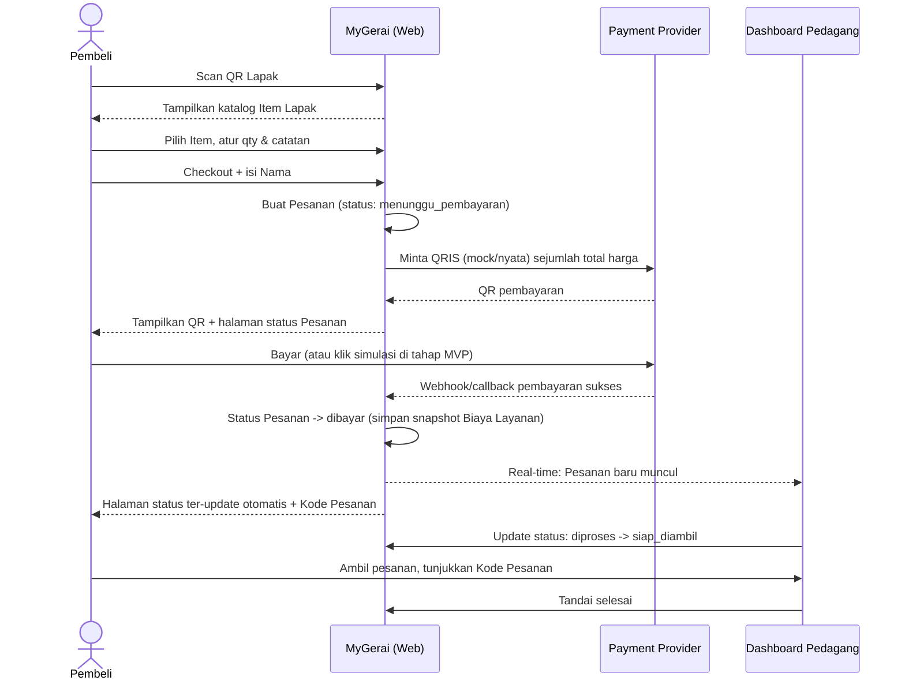

# PRD — Product Requirements Document: MyGerai

> Status: **Draft awal (fase ground truth), belum ada kode produksi.**
> Lihat [RULES.md](RULES.md) §3 sebelum mengubah dokumen ini — perubahan signifikan wajib dikonfirmasi User dan dicatat di [CHANGELOG.md](../CHANGELOG.md).

## Nama Produk

Nama kerja: **MyGerai** (diambil dari nama folder proyek `MyPlaza ESB (MyGerai)`). Ini **provisional** — belum final, boleh diganti User kapan pun tanpa proses khusus (cukup update dokumen ini + cari-ganti di kode saat itu terjadi).

## 1. Latar Belakang & Masalah

Pedagang kecil di pinggir jalan/pasar (tukang bakso, batagor, cakue, penjual baju, dll) umumnya:
- Melayani pembeli satu per satu secara manual, sering antre & salah catat pesanan.
- Sudah menerima QRIS tapi statis/generik (satu QR tempel), tanpa kaitan ke item yang dipesan.
- Tidak punya sistem pencatatan pesanan/transaksi.

Inspirasi: **[ESB Order](https://www.esb.id/id/solusi/produk/order)** (bagian dari ekosistem ESB, sistem operasional resto skala menengah–besar) — pembeli scan QR di meja, pilih menu, isi data diri singkat (tanpa akun), bayar (online/di kasir), lalu pesanan otomatis masuk ke dapur/kasir setelah pembayaran terverifikasi.

MyGerai mengadaptasi **inti alur ESB Order** (scan → pilih → bayar → masuk ke penjual) tapi disederhanakan drastis untuk skala pedagang kaki lima:
- Tidak ada konsep meja/dine-in (tidak ada tempat duduk formal).
- Tidak multi metode bayar — **QRIS saja**.
- Data Pembeli **hanya nama**, bukan email/HP/dsb.
- Tidak ada integrasi ojek online/multi-channel marketplace (di luar scope MVP).

## 2. Tujuan Produk

1. Pembeli bisa memesan & membayar tanpa mengantre dan tanpa perlu install aplikasi/daftar akun.
2. Pedagang menerima pesanan yang **sudah dibayar** secara real-time di HP-nya, tanpa salah catat.
3. Aplikator (pemilik platform) mendapat **Biaya Layanan** per transaksi sukses, dengan nominal yang bisa diatur.

## 3. Target Pengguna & Peran

| Peran | Siapa | Butuh akun? |
|---|---|---|
| **Pembeli** | Siapa saja yang lewat & mau beli dari sebuah Lapak | **Tidak** — cukup isi Nama saat checkout |
| **Pedagang** | Pemilik Lapak (tukang bakso, dll) | Ya — daftar mandiri (self-service), lalu **menunggu approval Admin** |
| **Admin** | Pengelola internal Aplikator (User sendiri di tahap awal) | Ya |

## 4. Lingkup MVP (In Scope)

- [ ] Pedagang daftar mandiri (nama Lapak, kategori, kontak, foto) → status `pending` → Admin approve → Lapak dapat **QR Lapak** unik.
- [ ] Pedagang kelola daftar Item (nama, harga, foto, status tersedia/habis) di dashboard sendiri.
- [ ] Pembeli scan **QR Lapak** → lihat katalog Item Lapak tsb (tanpa login).
- [ ] Pembeli pilih Item + qty + catatan → Keranjang (di sisi browser) → Checkout.
- [ ] Saat checkout, Pembeli **wajib isi Nama** (field lain tidak ada).
- [ ] Sistem membuat Pesanan berstatus `menunggu_pembayaran` + menampilkan QRIS.
  - **Tahap MVP awal: QRIS ini disimulasikan** (`MockPaymentProvider`) — ada tombol "Simulasikan Pembayaran Berhasil" untuk keperluan uji alur, belum integrasi nyata ke payment gateway. Lihat [TEKNOLOGI.md](TEKNOLOGI.md#payment-provider-abstraction) dan [BACKLOG.md](BACKLOG.md) untuk kapan integrasi nyata (Tripay) menyusul.
- [ ] Begitu pembayaran terkonfirmasi → status jadi `dibayar` → **real-time** muncul di dashboard Pedagang.
- [ ] Pedagang update status Pesanan: `diproses` → `siap_diambil` → `selesai`.
- [ ] Pembeli melihat status Pesanannya + **Kode Pesanan** di halaman setelah checkout (di-refresh otomatis/real-time), untuk ditunjukkan ke Pedagang saat mengambil.
- [ ] Pesanan yang tidak dibayar dalam waktu tertentu → `kedaluwarsa` otomatis (nilai waktu dapat dikonfigurasi Admin, default 15 menit).
- [ ] Admin: approve/reject Pedagang baru, atur nominal **Biaya Layanan** (default Rp1.000/pesanan sukses), lihat daftar transaksi & **Saldo Pedagang**, catat **Pencairan** manual per Pedagang.

## 5. Di Luar Lingkup MVP (Out of Scope — dicatat sebagai ide masa depan di [BACKLOG.md](BACKLOG.md))

- Integrasi payment gateway **sungguhan** (Tripay) — menyusul setelah alur inti stabil.
- Metode bayar selain QRIS (tunai, transfer manual, dompet digital langsung).
- Pencairan otomatis via API disbursement.
- Varian Item (ukuran baju S/M/L, level pedas, dsb).
- Multi-Lapak per satu Pedagang.
- Riwayat Pesanan Pembeli lintas sesi (karena tanpa akun).
- Notifikasi WhatsApp/SMS ke Pembeli atau Pedagang.
- Laporan analitik penjualan mendalam.
- Aplikasi mobile native (MVP = web saja, mobile-first).
- Multi-bahasa (MVP: Bahasa Indonesia saja).
- Pengelompokan Lapak per lokasi/pasar fisik.

## 6. Alur Pengguna

### 6.1. Alur Pembeli

### 6.2. Alur Pedagang (onboarding)

1. Buka halaman daftar Pedagang → isi nama Lapak, kategori, nama pemilik, kontak (nomor HP), foto/banner.
2. Buat akun (nomor HP + password — lihat [TEKNOLOGI.md](TEKNOLOGI.md#autentikasi) untuk alasan tanpa OTP di MVP).
3. Status Lapak `pending` → menunggu Admin approve.
4. Setelah `approved` → Pedagang bisa login ke dashboard, tambah Item, dan **QR Lapak** aktif (bisa didownload/dicetak).
5. Pesanan yang masuk sebelum approve tidak mungkin terjadi (QR belum aktif/tidak bisa diakses publik).

### 6.3. Alur Admin

1. Login ke panel Admin.
2. Lihat daftar Pedagang `pending` → approve atau reject (dengan alasan).
3. Atur konfigurasi: nominal Biaya Layanan, durasi kedaluwarsa Pesanan.
4. Lihat daftar transaksi & akumulasi Saldo Pedagang per Lapak.
5. Catat Pencairan manual (tandai "sudah dicairkan Rp X ke Lapak Y tanggal Z") — MVP belum ada transfer otomatis.

## 7. Aturan Bisnis

- **Biaya Layanan**: default **Rp1.000** per Pesanan berstatus `dibayar`. **Dapat dikonfigurasi** Admin (nominal, dan disiapkan agar bisa berkembang jadi persen di masa depan — lihat [DATA-MODEL.md](DATA-MODEL.md)). Nilai yang berlaku disimpan sebagai **snapshot** di tiap Pesanan agar histori laporan tidak berubah retroaktif saat konfigurasi diubah.
- **Model settlement**: **Agregator** — semua pembayaran (nantinya, saat integrasi nyata) masuk ke satu akun milik Aplikator; Pedagang tidak perlu akun payment gateway sendiri. Pencairan ke Pedagang dilakukan Aplikator secara berkala, dikurangi Biaya Layanan.
- **Kedaluwarsa Pesanan**: default 15 menit sejak dibuat jika belum `dibayar`. Dapat dikonfigurasi Admin.
- **Approval Pedagang**: wajib di-approve Admin sebelum QR Lapak bisa dipakai publik (kontrol kualitas dasar, cegah penyalahgunaan).
- **Pembeli tanpa akun**: hanya field **Nama** (bebas isi, tidak diverifikasi) — tidak ada validasi identitas.

## 8. Risiko & Catatan

- **Regulasi**: Model Agregator berarti Aplikator (secara teknis, lewat Payment Provider berlisensi seperti Tripay) menampung dana sementara sebelum dicairkan ke Pedagang. Selama pencairan dilakukan lewat penyedia payment gateway berizin (bukan menahan dana sendiri di luar sistem tsb) dan bukan disbursement massal otomatis tanpa izin, risiko relatif rendah untuk skala kecil — **tetap perlu ditinjau ulang jika skala transaksi membesar** (lihat [ARSITEKTUR-SISTEM.md](ARSITEKTUR-SISTEM.md)).
- **Pembeli tanpa identitas terverifikasi**: nama bisa diisi asal-asalan. Risiko diterima untuk MVP (dampaknya kecil — hanya salah panggil nama saat ambil pesanan, Kode Pesanan jadi identifier utama).
- **Status badan usaha Aplikator saat ini: perorangan** — pengaruh ke pemilihan payment gateway (lihat [TEKNOLOGI.md](TEKNOLOGI.md)) dan limit transaksi; perlu ditinjau ulang jika bisnis berkembang (naik jadi NIB/PT/CV).
